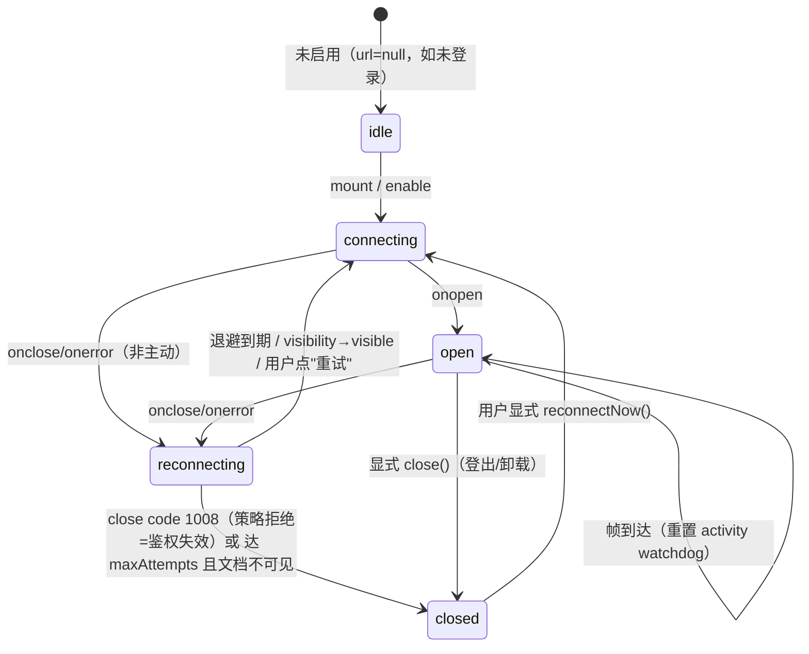

# Thumbelina 前端工程化（主题六）详细设计与任务拆解

- 日期：2026-08-29
- **溯源**：本文档是《Thumbelina 架构与数据层重构规划》（`docs/plans/2026-08-29-architecture-refactoring-plan.md`）**主题六：前端工程化（对应 §2.5 F1–F6）**的展开细化，排期锚点为该文档 §4 Phase 0（F1）与 Phase 5（其余），风险口径参照 §5。
- 范围：`frontend/src/**`（约 15.9k 行 TS/TSX + 5790 行 App.css）、`frontend/{tsconfig.app.json, tsconfig.json, vite.config.ts, package.json, eslint.config.js}`、`.github/workflows/ci.yml`；后端仅作为**契约面只读核查**（`src/thumbelina/api/websocket.py`、`api/schemas.py`、`api/routes/*`、`api/app.py`）。
- 取证方式：全部源码精读（`useWebSocket.ts` 682 行全文、`App.tsx` 264 行全文、两座巨石页面全文、`api/` 与 `types/` 全部文件、三份 Modal 实现）+ 只读命令实测（`npx tsc` 三种配置、进程内 `create_app(AppConfig()).openapi()`、`grep` 清单）。**本文档未修改任何代码文件。**
- 与总规划不一致之处统一登记在 **§9 与总规划的偏差**（**D1–D11 共 11 条**：事实修正 5 条、口径补充 4 条、依赖与排期重算 2 条）。

---

## 0. 实测基线（本文所有数字的口径）

| 项 | 实测值 | 取证 |
|---|---|---|
| 非 `api/` 层裸 `fetch(` | **27 处**（9 个组件 25 + `App.tsx:124` 1 + `useWebSocket.ts:589` 1） | `grep -n "fetch("` |
| `api/` 层 fetch | 28 处；`request<T>` 本地封装重复 **3 份**（`llmConfig.ts:105`、`todo.ts:26`、`toolsConfig.ts:14`），其余逐函数手写（`conversations.ts` 10、`rag.ts` 12、`trajectory.ts` 2、`fs.ts` 1） | 同上 |
| `tsc --strict`（不含 `noUncheckedIndexedAccess`） | **0 报错**（现状非 strict 却有"显式 any 为 0"的真实原因见 §5） | `npx tsc -p tsconfig.app.json --strict --noEmit` |
| `tsc --strict --noUncheckedIndexedAccess` | **107 报错** = 测试文件 100 + 业务代码 7 | 同上 + `--noUncheckedIndexedAccess` |
| 后端 OpenAPI | **可用**：75 paths / 93 operations / 79 op 有类型化 200 / 16 op 弱类型（`additionalProperties` 或无 200）/ 72 component schemas | 进程内 `app.openapi()` |
| i18n | en 464 键、zh-CN 464 键，**差集为空**；**但无 parity 自动化测试** | node 扁平化比对 |
| 测试文件 | **38** 个（`useWebSocket.test.ts` 15 用例，含现成的 `MockWebSocket` 类 :6-45） | `find src -name '*.test.*'` |
| App.css | 5790 行、54 个 `/* ===== X ===== */` 段落；被 `main.tsx:5` 与 `App.tsx:18` **重复 import** | grep |
| 硬编码色 | App.css 命中 20 行：真违规 11 / `var(--x, #hex)` 兜底 6 / 品牌渐变 3（§6.2 清单） | grep `-E "#[0-9a-fA-F]{3,8}\|rgba?\("` |
| `useState` | `TodoPage.tsx` 18（分布在同文件 3 个组件）、`KnowledgeBasePage.tsx` 30（全在单函数体内） | `grep -c useState` |
| `CoderPage` props | **15**（不是 14；见 §9-D2） | `CoderPage.tsx:10-26` |

---

## 1. WS 层设计（最优先，Phase 0）

### 1.1 现有 682 行的职责分解与逐 ref 归属（**必须原样保留的行为**）

现实现把 5 件事揉进一个 682 行 hook：传输生命周期、流式打字机、消息列表状态机、会话注册表（known/new/last）、历史对账。拆分的第一原则是**"做得好的竞态补偿逻辑一律原样迁移"**（总规划 §2.5 尾段结论，本次读码逐条确认成立）。

| # | 现有状态（file:line） | 承担的行为（为什么存在） | 新归属 | 迁移要点 |
|---|---|---|---|---|
| 1 | `wsRef` (:40) | 唯一的 socket 句柄 | `useWsConnection` | 换成 `socketRef` + `generationRef`（每次重连自增，用于丢弃旧实例回调——见 §1.5 R1） |
| 2 | `knownConversationsRef` (:41) | 判定"会话是否首次出现"，只在首次时置 `newConversationId`，避免每次 chunk 都触发侧栏刷新 | `wsReducer` 状态 `knownConvIds: Set<string>` | reducer 里由 `ws/conversation_created`、`ws/connected`、`ws/channel_message`、`ws/chunk`、`ws/done`、`ws/stopped`、`ws/response`、`ws/error` 八个分支共同维护，抽成 `touchConversation()` 单一内部函数（现在这 8 处是复制粘贴：:210-214、:246、:260、:278-281、:317-320、:395-398、:415-418、:459-462） |
| 3 | `activeConversationRef` (:42) | 在回调闭包里读"当前活动会话"，避免 `onmessage` 闭包过期（effect 依赖只有 `[url]`，:516） | `useWsConnection` 持 `getActiveConvId()` getter（由 context 注入） | 保留 ref 语义但改为**注入的读取器**；不再有 `useEffect` 同步（:81-83） |
| 4 | `lastConversationIdRef` (:43) | `sendMessage` 缺省会话时取最近一次后端告知的 id（:519） | reducer 状态 `lastConversationId` | 与 `setLastConversationId` 一并进 reducer，去掉 :85-87 的 state→ref 双写 |
| 5 | **`sessionConvRef` (:48)** | **在飞请求的归属会话**；`'@pending'` 哨兵表示"已发出但后端尚未分配 id"；`null` 表示无在飞。后端每连接串行（`websocket.py:263-265`），故同时只有一个 | reducer 状态 `inFlight: { convId: string \| '@pending' } \| null` | **必须保留 `'@pending'` 的三处回填**（:215-218 error 帧、:263-269 created 帧、:333-337 chunk 帧），并保留 `activeConversationRef.current = created` 的"提前认领"（:267、:334） |
| 6 | `bufferRef` / `reasoningBufferRef` / `displayedRef` (:51-53) | 打字机缓冲：全量文本 + 已显示字符下标；切走再切回时靠它续播 | `useStreamBuffer`（模块内 ref） | 三个 ref 一起走，禁止再拆到 reducer（每 tick 一次 dispatch 会把 30ms 列表更新放大成 React 树大改，见 §1.4 决策） |
| 7 | `msgIdRef` / `twMsgIdRef` (:54-55) | 自增 id 分配；流式消息用 `stream-` 前缀（:357），收尾时换成真实 id（:130、:403、:447） | `useStreamBuffer` 持 `nextId()`；`stream-` 前缀约定进 `types/ws.ts` 常量 | `MessageList.tsx:110` 依赖 `id.startsWith('stream-')` 判定思考块展开——前缀常量化后两侧同步引用 |
| 8 | **`twTimerRef` (:56)** | 打字机 interval；**现在只在卸载清理（:511-512），`onclose/onerror` 不清（:490-508）→ F1 第三患** | `useStreamBuffer`，由 `useWsConnection` 的 `close` 事件强制 `teardown()` | 这是 F1 修复点之一，必须有单测（§8.2 T-WS-14） |
| 9 | `streamDoneRef` (:57) | `done` 帧早于打字机追上时，标记"排空即收尾"（:432-438、:129-131） | `useStreamBuffer` | 保留 |
| 10 | `replyTimerRef` (:58) | 90s 回复超时（:31、:168-186），**任意入站帧即清除**（:204） | reducer 侧 `timeout/reply_expires` action + `useWsConnection` 帧到达派发 `clear` | 与重连退避定时器**互斥**：进入 `reconnecting` 时必须清掉 reply timer，否则重连期间叠加一条"Request timed out"假错（新约束，§1.5 R7） |
| 11 | **`streamConvRef` (:61)** | 决定 `clearMessages(convId)` 是否连带丢弃缓冲：只有"被清的会话正是缓冲归属会话"才丢（:658-663） | `useStreamBuffer.snapshot().ownerConvId` | 语义等价迁移；`ChatWindow.tsx:48-54` 的切换三连（switch+clear+loadHistory）依赖它 |
| 12 | **`completedContentRef` (:64)** | **DB 写入竞态补偿**：回复已完成但历史接口可能早于落库，切回时把快照补进列表（:422-428 done、:465-470 response、:625-644 loadHistory 合并 + 去重） | `useStreamBuffer.completed: {convId, content, reasoning}` 快照槽 | 保留"内容等值去重"（:631）与"消费即清空"（:628） |
| 13 | **`historyFetchRef` (:66)** | 单调序号守卫历史响应乱序（:587 `++`，:595 `fetchId !== ref` 丢弃） | `ConversationContext.loadHistory` 或 reducer `reconcile/response` 守卫 | 保留；`App.tsx:37 latestFetchRef` 是**同一模式的第二份**（会话列表拉取），一并收进 `api/` 层 `latestOnly()` 工具（§3.2） |
| 14 | `awaitingMoreRef` + `setAwaitingMore` (:71-78) | 值变化才 setState，避免每 tick 无谓重渲染 | `useStreamBuffer` | 保留（这是现实现里少见的正确优化） |
| 15 | `isConnected/isStreaming/streamingMode/lastConversationId/newConversationId/streamingConvId/waitingConvIds` (:34-49) | 派生 UI 状态 | reducer 状态 | 派生量 `isStreamingActive`/`waitingForReply`（:673-677）改为 selector（§1.4） |

### 1.2 连接状态机



**States**：`idle | connecting | open | reconnecting | closed`（暴露给 UI 的就这 5 个；不再有"布尔 `isConnected` + 未定义的重连中间态"）。

**Events**：`CONNECT`, `SOCK_OPEN`, `SOCK_CLOSE{code}`, `SOCK_ERROR`, `BACKOFF_FIRE`, `VISIBILITY{visible}`, `EXPLICIT_CLOSE`, `POLICY_REJECT(1008)`, `FRAME_IN`。

**Transitions / 副作用表**（副作用全部集中在 reducer 与 connection hook，UI 不感知）：

| from | event | to | 副作用 |
|---|---|---|---|
| idle | CONNECT | connecting | `new WebSocket(url)`，`generation++`；清 attempt |
| connecting | SOCK_OPEN | open | ①**重放发送队列**（FIFO）②`reconcile('open')`（对账当前活动会话历史）③`attempt=0` ④清 reply timer ⑤挂 `visibilitychange` |
| any | SOCK_CLOSE / SOCK_ERROR | reconnecting | ①`teardown()` 打字机（**F1 修复**，对齐 `useWebSocket.ts:490-508` 缺失项）②清 reply timer ③`inFlight=null`、`waiting=[]`、`streamingConvId=null` ④**保留 `messages` 与 `completed` 快照**（断线不该抹掉已见内容）⑤调度退避 |
| reconnecting | BACKOFF_FIRE | connecting | 同 CONNECT；重连失败**不**重置退避计数 |
| reconnecting/closed | VISIBILITY{visible} | connecting | **立即**跳退避（延迟按 0 计），并置 `needsReconcile=true` |
| open | VISIBILITY{hidden} | open | 只记录时间戳，不主动断开（切后台不应丢连接） |
| open | 对账触发（重连成功 / 回前台） | open | `reconcile('visible')`：`GET /conversations/{id}` 与本地列表比对，命中 §1.5 R2/R3 补偿路径 |
| any | POLICY_REJECT(1008) | closed | 停退避、置 `authExpired=true`，UI 出"登录已过期"（主题一合流点） |

**退避序列**：`delay(n) = min(1000 · 2^(n-1), 30000) · jitter(±20%)` → `1s, 2s, 4s, 8s, 16s, 30s, 30s, …`；`maxAttempts = Infinity`（文档可见时持续重试），文档隐藏时只重试到第 6 次后暂停，等 `visibilitychange` 唤醒。**决策：不做"永久放弃"**——个人 NAS 长停机重启后浏览器标签应能自愈。

**心跳（与总规划的差异，§9-D4）**：浏览器 `WebSocket` 无法发 ping，且后端 `websocket.py` 目前无 ping/pong 帧。本主题做法：
1. **被动判活**：`onclose/onerror` + `send()` 抛错 + 90s reply timeout（现 :31/:168）三件套已能覆盖"半开连接"在 UI 上的最坏表现（新架构再补 `reconcile` 拉一次 `GET /health` 判"服务器活着但 socket 死了"，此时强制 `reconnecting`）。
2. **可选主动心跳**：定义协议扩展 `{ping: number} → {pong: number, ts: string}`（后端 3 行改动，落点在 `websocket.py:203` 主循环分支前），前端预留 `heartbeat?: {intervalMs, timeoutMs}` 配置，**默认 `null`**。该改动归属主题五（WS 契约）而非本主题，不阻塞合入。

### 1.3 发送队列的入队 / 重放 / 丢弃语义

三类帧、三套语义（现在只有"OPEN 才发、否则整段丢弃"一条路径：`useWebSocket.ts:533` 无 else、`switchConversation:580-584` 静默、`stopGeneration:570-578` 静默）：

| 类别 | 帧 | 断线时 | 队列内 | 重放 | 丢弃条件 | UI 映射 |
|---|---|---|---|---|---|---|
| **must-deliver** | `{message}` 聊天正文 | **入队**，返回 `'queued'` | FIFO，容量 20，溢出丢**最旧**（并插一条 system 提示"离线消息已丢弃"） | 重连 `onopen` 后按序重放；首帧到达才把 user 消息写入 transcript（**不再"连自己的消息都不显示"**，修 F1 第二患） | TTL 120s / 容量溢出 / 显式 close | composer 上方出箱条 `待发送 N`；status='reconnecting' 时输入框**不 disabled**、placeholder 改"离线，消息将排队" |
| **latest-wins（状态帧）** | `{switch_conversation}` | 入队，**按 key 覆盖**（只留最后一条） | 同 | 重放一条 | 被更新的一条取代 | 无 |
| **latest-wins** | `{stop: true, conversation_id}` | 入队，按 `convId` 覆盖；该会话流已结束则丢弃 | 同 | 重放 | 已 stopped/done | Stop 按钮置"发送中…" |
| **drop-fast** | 任何未知帧 | 直接丢 + `console.warn` | — | — | 总是 | — |

队列状态进 reducer（`outbox: QueuedFrame[]`），`QueuedFrame = { id, kind, payload, enqueuedAt, convHint, expiresAt }`。**关键约束**：排队中的 user 消息**不进 `messages`**（否则被丢弃后 transcript 里留下一条从未发出的消息，比现状更糟），只在出箱条显示摘要。

### 1.4 三个模块的 TypeScript 接口签名

`types/ws.ts`（线协议 + 契约测试的唯一真源，替换 `useWebSocket.ts:4-24` 的内联 `WsIncoming`）：

```ts
/** 后端 → 前端（穷举自 src/thumbelina/api/websocket.py 与 app.py 广播） */
export interface WsIncoming {
  chunk?: string
  chunk_type?: 'reasoning' | (string & {})       // websocket.py:98/108
  response?: string                               // websocket.py:125
  done?: boolean                                  // websocket.py:127-133
  stopped?: boolean                               // websocket.py:224-229
  error?: string                                  // websocket.py:207/213/238/253/257/276/119
  conversation_id?: string | null
  streaming_mode?: boolean                        // websocket.py:131（仅随 done 出现）
  connected?: boolean                             // ⚠ 后端当前从不发（§9-D3）
  conversation_switched?: boolean                 // websocket.py:241-246
  conversation_created?: string                   // websocket.py:272
  channel_message?: { channel: string; conversation_id: string; user_message: string;
                      response: string; source?: string }   // app.py:614 / wechat.py:271
  pong?: number                                   // 预留（§1.2 心跳）
}
export type WsOutgoing =
  | { message: string; conversation_id?: string }
  | { stop: true; conversation_id?: string }
  | { switch_conversation: string }
  | { ping: number }
export const PENDING_CONV = '@pending'
export const STREAM_ID_PREFIX = 'stream-'
export type ConnStatus = 'idle' | 'connecting' | 'open' | 'reconnecting' | 'closed'
```

`state/wsReducer.ts`（**纯函数，不碰 socket、不碰定时器**）：

```ts
export interface WsState {
  status: ConnStatus
  attempt: number                 // 退避第几次
  nextRetryAt: number | null
  authExpired: boolean
  messages: Message[]             // 仅"活动会话"的 transcript（沿用现模型，避免重写 MessageList）
  inFlight: { convId: string } | null          // 含 '@pending'（ref #5）
  streamingConvId: string | null
  waitingConvIds: string[]        // '@pending' 也在内
  lastConversationId: string | null
  newConversationId: string | null
  knownConvIds: ReadonlySet<string>
  outbox: QueuedFrame[]
  pendingUserIds: string[]        // 出箱条用
}
export type WsAction =
  // —— 传输 ——
  | { type: 'conn/open'; now: number }
  | { type: 'conn/close'; now: number; scheduledRetryAt: number | null; reason?: string }
  | { type: 'conn/retry_scheduled'; attempt: number; nextRetryAt: number }
  | { type: 'conn/policy_reject' }                     // 1008
  | { type: 'conn/explicit_close' }
  // —— 线协议帧（与后端分支 1:1，穷举 useWebSocket.ts:194-487）——
  | { type: 'ws/error'; error: string; conversationId: string | null; now: number }        // :206-238
  | { type: 'ws/streaming_mode'; enabled: boolean }                                        // :240-242
  | { type: 'ws/connected'; conversationId: string }                                       // :245-250（后端未实现，保留兼容）
  | { type: 'ws/switched'; conversationId: string }                                        // :253-255
  | { type: 'ws/conversation_created'; conversationId: string }                             // :258-271
  | { type: 'ws/channel_message'; payload: NonNullable<WsIncoming['channel_message']> }     // :274-309
  | { type: 'ws/chunk'; chunk: string; chunkType?: string; conversationId: string | null }  // :312-385
  | { type: 'ws/stopped'; conversationId: string | null }                                   // :391-408
  | { type: 'ws/done'; conversationId: string | null; streamingMode?: boolean }              // :411-452
  | { type: 'ws/response'; text: string; conversationId: string | null }                     // :455-487
  // —— 流式渲染回写（由 useStreamBuffer 的定时器驱动）——
  | { type: 'stream/begin'; conversationId: string | null; msgId: string }
  | { type: 'stream/reveal'; msgId: string; text: string; thinking?: string }
  | { type: 'stream/finalize'; msgId: string; finalId: string; text: string; thinking?: string }
  | { type: 'stream/recreate'; msgId: string; text: string; thinking?: string }   // 对应 :144-159 视图切回补建
  // —— 发送与队列 ——
  | { type: 'send/enqueue'; frame: QueuedFrame }
  | { type: 'send/coalesce'; key: string; frame: QueuedFrame }                    // switch / stop
  | { type: 'send/accepted'; id: string; userMsgId: string; convHint: string }    // 真正 write 成功
  | { type: 'send/dropped'; id: string; reason: 'ttl' | 'overflow' | 'unknown' }
  | { type: 'send/failed'; id: string }                                           // :551-566 的 system 错误行
  // —— 对账 / 会话视图 ——
  | { type: 'conv/select'; conversationId: string | null }
  | { type: 'reconcile/stale'; fetchId: number }                                  // ref #13 守卫
  | { type: 'reconcile/history'; conversationId: string; fetchId: number; history: Message[];
      reattach: StreamSnapshot | null; completed: CompletedReply | null }         // :604-645 全部合并逻辑在此
  | { type: 'timeout/reply_expires'; now: number }                                // :168-186
  | { type: 'conv/clear_messages'; conversationId?: string }                       // :651-664
  | { type: 'conv/new_consumed' }                                                  // clearNewConversation :666
export function wsReducer(state: WsState, action: WsAction): WsState
export const initialWsState: WsState
// selectors（把 :673-677 的派生集中一处，供 ChatWindow/CoderPage 使用）
export const selectIsStreamingFor = (s: WsState, activeId?: string) =>
  s.streamingConvId !== null && (s.streamingConvId === null || s.streamingConvId === activeId)
export const selectWaitingFor = (s: WsState, activeId?: string) => boolean
export const selectBusyConversations = (s: WsState) => ReadonlySet<string>
```

> **决策（写进验收）**：打字机的**逐字文本不进 reducer 的 dispatch 流**——`CHARS_PER_TICK=3 / TICK_INTERVAL=30ms`（:26-27）若每 tick 一次 dispatch，React 19 下每次都是 reducer 全 state 复制 + 全列表 map（`MessageList.tsx:120-147`），是 F6"全列表 reconcile"的根因。方案：文本由 `useStreamBuffer` 直接经 `setMessages` 的函数式更新写入（沿用现路径 :143-164），但**只在文本实际变化时**写；同时 `MessageList` 改为 `React.memo` + 把流式那条单独渲染（T6-24）。reducer 只负责 `stream/begin|finalize|recreate` 这三个结构性事件。

`hooks/useWsConnection.ts`：

```ts
export interface UseWsConnectionOptions {
  url: string | null                                   // null ⇒ 不连接（idle）
  onAction: (action: WsAction) => void                 // 直接把线帧翻成 dispatch
  getActiveConversationId: () => string | null         // 取代 activeConversationRef prop 同步
  onReconcile?: (reason: 'open' | 'visible') => void   // 对账回调（ConversationContext.loadHistory）
  backoff?: { baseMs: number; capMs: number; jitter: number; maxAttemptsWhileHidden: number }
  heartbeat?: { intervalMs: number; timeoutMs: number } | null   // 默认 null（§1.2）
  queuePolicy?: { capacity: number; ttlMs: number }
  socketFactory?: (url: string) => WebSocketLike       // 测试注入（现 MockWebSocket 模式）
}
export interface UseWsConnectionResult {
  status: ConnStatus
  attempt: number
  nextRetryAt: number | null
  canWrite: boolean
  send: (frame: WsOutgoing, meta?: { kind: 'message' | 'switch' | 'stop'; key?: string; convHint?: string })
        => 'sent' | 'queued' | 'coalesced' | 'dropped'
  reconnectNow: () => void
  close: () => void
}
export function useWsConnection(options: UseWsConnectionOptions): UseWsConnectionResult
```

`hooks/useStreamBuffer.ts`（打字机 + reply 超时 + 两个补偿快照的**唯一持有者**）：

```ts
export interface StreamSnapshot { ownerConvId: string | null; text: string; reasoning: string; revealed: number; msgId: string }
export interface CompletedReply { convId: string; content: string; reasoning: string }
export interface UseStreamBufferOptions {
  dispatch: (a: WsAction) => void
  getActiveConversationId: () => string | null
  rate?: { charsPerTick: number; intervalMs: number }
  replyTimeoutMs?: number
}
export interface UseStreamBufferResult {
  begin(convId: string | null): void                              // :356-373
  appendChunk(text: string, kind: 'content' | 'reasoning', convId: string | null): void  // :345-350
  markDone(): void                                                // :432-438
  finalize(finalId?: string): void                                // stopTypewriter :101-122
  captureCompleted(reply: CompletedReply | null): void            // :422-428 / :465-470
  snapshot(): StreamSnapshot | null                               // 供 loadHistory 续播 :608-624
  takeCompleted(convId: string): CompletedReply | null            // 消费式读取 :625-644
  ownerOf(convId: string): boolean                                // streamConvRef 语义 :658
  teardown(): void                                                // ★ onclose 必调（F1）
  clearIfOwner(convId: string): void                              // :659-663
  armReplyTimeout(): void; clearReplyTimeout(): void              // :168-186 / :204
  readonly streaming: boolean
  readonly streamingConvId: string | null
  readonly awaitingMoreContent: boolean
}
export function useStreamBuffer(options: UseStreamBufferOptions): UseStreamBufferResult
```

`hooks/useWebSocket.ts`（重写后的**组合壳**，目标 ≤120 行，签名与返回值**保持不变**，因此 `ChatWindow.tsx:32` 与 `ChatSocket`（:682）的全部消费方零改动）：

```ts
export function useWebSocket(url: string, activeConversationId?: string): {
  messages; isConnected; isStreaming; streamingMode; waitingForReply;
  awaitingMoreContent; lastConversationId; newConversationId;
  clearNewConversation; sendMessage; stopGeneration; clearMessages; switchConversation; loadHistory
}
// 新增（向后兼容的增量）：
//  status: ConnStatus; outbox: QueuedFrame[]; attempt; nextRetryAt; reconnectNow()
```

### 1.5 逐竞态场景对照表（现实现处理了什么 → 新架构由谁保证）

| # | 场景 | 现有代码 | 新架构保证方 | 测试锚点 |
|---|---|---|---|---|
| R1 | **重连后旧 socket 的迟到回调**污染新连接（当前不存在重连，故无此问题，但引入重连后必然出现） | — | `useWsConnection` 的 `generationRef`：每个 `on*` 回调首行比对 `ev.target === socketRef.current && gen === generationRef.current`，否则丢弃 | §8.2 T-WS-09 |
| R2 | **历史拉取乱序**：快速 A→B 切换，A 的响应晚于 B 到达，覆盖当前视图 | `historyFetchRef` :587/595 | reducer `reconcile/history.fetchId` 守卫（`fetchId !== state.lastFetchId` ⇒ no-op） | 现有用例 `ignores stale history responses`（test:355）必须**原样通过** |
| R3 | **DB 写入竞态**：`done` 已收到、历史接口却返回未落库的列表 | `completedContentRef` :64/422-428/465-470 + 合并去重 :625-644 | `useStreamBuffer.takeCompleted()` + reducer `reconcile/history.completed` | 手工回归场景 3；新增单测 §8.1 A-12 |
| R4 | **流式中切走再切回被截断** | `sessionConvRef===conversationId` 分支 :608-624（用缓冲续播、`displayedRef=buffer.length`、重启打字机） | `useStreamBuffer.snapshot()` + reducer `reconcile/history.reattach` | 现有用例 `preserves an in-flight response when switching away and back mid-stream`（test:262） |
| R5 | **视图里流式消息被卸载**（切页面期间 `messages` 被清空，打字机还在跑） | :144-159 打字机回调内按需补建消息 | reducer `stream/recreate`（由 reveal 路径触发） | §8.1 A-13 |
| R6 | **`'@pending'` → 真实 id 回填**：首条消息在会话分配前发出 | :215-218 / :263-269 / :333-337 三处 | reducer `ws/error|conversation_created|chunk` 共用 `settlePendingConv()` helper（**把三处复制收敛成一处**） | §8.1 A-14 |
| R7 | **90s 回复超时 vs 断线** | :168-186 + :204 清定时器 | reducer `conn/close` 必带 `clearReplyTimeout`；`timeout/reply_expires` 只在 `status==='open'` 时注入 system 消息 | §8.2 T-WS-12 |
| R8 | **上一会话打字机未排空时下一回复开始**（后端串行但前端打字机慢） | :327-329 立即 finalize 前一个 | reducer `ws/chunk` 前检测 `buffer.ownerConvId !== conv` ⇒ 先 `stream/finalize` | §8.1 A-15 |
| R9 | **非活动会话的内容不得渲染进当前列表** | :354 `isActiveView`、:476、:226、:284 | reducer 全部写 `messages` 的分支都要求 `convId === activeConversationId ?? true` | §8.1 A-16 |
| R10 | **一个会话忙不得锁住其它会话输入** | :673-677 派生 | `selectIsStreamingFor`/`selectWaitingFor` | 现有用例 `should not lock other conversations while one is streaming`（test:175） |
| R11 | **`clearMessages` 在切换与显式清空两种语境下行为不同** | `ChatWindow.tsx:51` 无参调用（保留缓冲）vs :83 带 id（丢弃） | `conv/clear_messages.conversationId` 可选参数语义照搬 + `buffer.clearIfOwner` | §8.1 A-17 |
| R12 | **断线时悬挂打字机 + 半截文本** | **现在未处理（F1）** | `useWsConnection` 在 `close` 事件里**必须** `buffer.teardown()`，并把半截文本 `stream/finalize` 落进 transcript（用户可见"到此为止"，而非无限跳动的假流） | §8.2 T-WS-14 |
| R13 | **StrictMode 双挂载导致 dev 下立刻 close 再重连**（React 19 `main.tsx:9` 已开 StrictMode） | 现状：effect cleanup 调 `ws.close()`（:514）→ 双连接 | 新 hook 用"引用计数 + 首次挂载守卫"或 `AbortController`，保证 dev 下只有一条活动 socket | §8.2 T-WS-15 |
| R14 | **发送后 socket 非 OPEN**（当前静默丢弃） | **未处理（F1）** | 入队 + `pendingUserIds` 出箱条 | §8.2 T-WS-05 |

---

## 2. 状态层设计（Phase 5）

### 2.1 目标 Provider 组合顺序与 `App.tsx` 形态

现状：`main.tsx:8-13` 只有 `LocaleProvider`；**没有 ThemeContext**（主题色在 `ThemeToggle.tsx:24-35` 用局部 `useState` + `document.documentElement` 副作用实现，总规划 §3 主题六第 4 条说"与 Locale/Theme 并列"是**预期而非现状**，见 §9-D5）；`App.tsx:20-252` 是唯一状态中枢。

```tsx
// main.tsx（目标）
createRoot(document.getElementById('root')!).render(
  <StrictMode>
    <LocaleProvider>            {/* 现有 src/i18n */}
      <ThemeProvider>            {/* 新增：从 ThemeToggle.tsx:13-35 提升（localStorage key 不变） */}
        <ApiClientProvider>      {/* 可选：注入 AuthBridge（主题一合流点） */}
          <ConversationProvider> {/* 新增：列表 + selectedId + CRUD */}
            <ChatSessionProvider>{/* 新增：持有 useWebSocket，暴露 socket + 派生 selector */}
              <App />
            </ChatSessionProvider>
          </ConversationProvider>
        </ApiClientProvider>
      </ThemeProvider>
    </LocaleProvider>
  </StrictMode>,
)
```

```tsx
// App.tsx（目标形态：约 60 行的组合壳 + 页面 switch）
function App() {
  const [activePage, setActivePage] = useState<Page>('chat')
  const [trajectorySessionId, setTrajectorySessionId] = useState<string>()
  const { visibleConversations, activeChatId } = useConversations()   // chat/coder 由 provider 按 page 切换语义
  const ws = useChatSession()
  return (
    <div className="app">
      <Header activePage={activePage} onNavigate={setActivePage} />
      <div className="app-body">
        {activePage === 'chat' && (<><Sidebar conversations={visibleConversations} /><ChatWindow ws={ws} /></>)}
        {activePage === 'coder' && <CoderPage />}
        {/* 其余 9 个页面不变；深链/lazy 仅在出现需求时引入（总规划主题六·第 10 条决策，维持不做） */}
      </div>
    </div>
  )
}
```

### 2.2 `ConversationContext` 接口

```ts
// state/ConversationContext.tsx
export interface ConversationsSnapshot { items: Conversation[]; loading: boolean; error: string | null }
export interface ConversationContextValue {
  chat: ConversationsSnapshot
  coder: ConversationsSnapshot
  selectedId?: string
  /** 当前页面语义下的活动 id：chat 页仅认 chat 列表、coder 页仅认 mode==='coder'（App.tsx:225 与 CoderPage.tsx:37 两条规则统一到此） */
  activeIdFor(mode: 'chat' | 'coder'): string | undefined
  select(id: string | undefined): void
  create(opts?: { mode?: 'chat' | 'coder'; workspace?: string | null }): Promise<Conversation>
  remove(id: string): Promise<void>
  rename(id: string, name: string): Promise<void>
  setEndpoint(id: string, endpointId: string | null, model: string | null): Promise<void>
  setKnowledgeBase(id: string, kbId: string | null): Promise<void>
  setRole(id: string, role: string | null): Promise<void>
  setThinking(id: string, enabled: boolean, effort: ThinkingEffort): Promise<void>
  refresh(mode: 'chat' | 'coder'): void
  /** WS 侧告知"后端新建/切换了会话"→ 列表与选中态更新（现 ChatWindow.tsx:65-71 的 prop 回调链） */
  adoptFromSocket(conversationId: string): void
}
```

### 2.3 `CoderPage` 15 props → context 迁移映射表

| 现 prop（`CoderPage.tsx:10-26`，App.tsx:201-217 传入） | 去向 | 备注 |
|---|---|---|
| `ws: ChatSocket` | `useChatSession()` | chat/coder **共用同一条连接**（`App.tsx:27-34` 注释是硬约束：换页不能断流），故 provider 必须挂在 App 之上而非页面内 |
| `conversations` | `useConversations().coder` | — |
| `selectedId` / `onSelect` | `selectedId` / `select` | — |
| `onCreated` | `create({mode:'coder', workspace})` + `select` | 现 `handleCoderConversationCreated:117-120` = select+refresh，收敛为一个方法 |
| `onDelete` / `onRename` | `remove` / `rename` | — |
| `onRefresh` | `refresh('coder')` | — |
| `coderLoading` / `coderError` | `coder.loading` / `coder.error` | 现 `App.tsx:65-79` 两个 useState |
| `onSetEndpoint` / `onSetKnowledgeBase` / `onSetRole` / `onSetThinking` | provider 四个同名方法 | 四者结构完全相同（`App.tsx:146-172` 各 7 行复制），合并为内部 `patch(id, updater)` + `updateConversationInState:133-137` |
| `onViewTrajectory` | 保留 prop 或 `usePageNavigation()` | 建议留 prop（纯页面跳转意图，`App.tsx:174-177`），或引入极薄 `PageContext`；**不为此上 Router** |

同一张表覆盖 `ChatWindow.tsx:17-29` 的 10 个 props（`ws/conversationId/conversations/onConversationCreated/onDefaultConversation/onSet{Endpoint,KnowledgeBase,Role,Thinking}/onViewTrajectory`），其中 `onConversationCreated`+`onDefaultConversation` 合并为 `adoptFromSocket`（消掉 `ChatWindow.tsx:65-71` 的四依赖 effect）。chat/coder 两分支的重复接线（总规划 F2 末句）就此消除。

---

## 3. API 层设计（Phase 5）

### 3.1 `api/client.ts` 完整接口

```ts
export type ApiErrorShape = 'envelope' | 'detail' | 'empty' | 'non_json' | 'network'
export class ApiError extends Error {
  readonly name = 'ApiError'
  status: number          // 0 = 网络/超时（fetch 抛 TypeError / AbortError）
  code: string            // 'unauthorized' | 'forbidden' | 'not_found' | 'validation' | 'upstream'
                          // | 'unavailable' | 'http_<status>' | 'network' | 'timeout'
  message: string
  details?: unknown
  shape: ApiErrorShape
  url: string
  method: string
  retryable: boolean      // 0/408/429/5xx ⇒ true（429 带 retryAfterMs）
  retryAfterMs?: number
  cause?: unknown
}
/** 与主题一解耦的关键：本主题只定义接口 + no-op 实现，主题一填实现（总规划 §3 依赖"必须同批合入"由此放宽，见 §9-D6） */
export interface AuthBridge {
  getAccessToken(): string | null
  /** WS 握手用的 query（主题一 websocket.py accept 前校验 ?access_token=） */
  getWebSocketQuery(): Record<string, string>
  /** 401 时调用：跳转登录 / 清 token；不得在此再触发 HTTP 请求（防风暴） */
  onUnauthorized(ctx: { url: string; method: string; error: ApiError }): void
}
export const nullAuthBridge: AuthBridge   // 默认：token=null、query={}、onUnauthorized=no-op

export interface ApiClientOptions {
  baseURL?: string                 // 默认 '/api/v1'
  timeoutMs?: number               // 默认 20_000；upload/query 可覆盖
  fetchImpl?: typeof fetch         // 测试注入
  auth?: AuthBridge
  onEvent?: (e: { kind: 'error'; error: ApiError } | { kind: 'retry'; attempt: number }) => void
}
export interface ApiClient {
  request<T>(path: string, init?: RequestInit & { body?: unknown; raw?: boolean }): Promise<T>
  get<T>(path: string, q?: Record<string, string | number | undefined | boolean>): Promise<T>
  post<T>(path: string, body?: unknown, init?: { timeoutMs?: number }): Promise<T>
  put<T>(path: string, body?: unknown): Promise<T>
  patch<T>(path: string, body?: unknown): Promise<T>
  del<T = void>(path: string, q?: Record<string, string>): Promise<T>
  /** multipart：不设 Content-Type，交浏览器生成 boundary */
  upload<T>(path: string, form: FormData): Promise<T>
  /** 下载（/data/export 现在 SettingsPanel.tsx:24 手写 fetch+blob） */
  download(path: string, filenameHint?: string): Promise<void>
  url(path: string): string
  wsUrl(path: string): string      // 拼 access_token，供 App.tsx:30-33 与主题一共用
}
export function createApiClient(opts?: ApiClientOptions): ApiClient
export const api: ApiClient         // 默认单例（nullAuthBridge）
export function configureAuth(bridge: AuthBridge): void   // 主题一启动时调用一次
```

**错误归一（迁移期双形状兼容）**——后端今天是 `{"detail": ...}`（`app.py:763-780` 全局 handler + 各路由 `raise HTTPException`），主题五要改成 `{"error":{code,message,details}}`：

1. `error.code`：新形状取 `error.code`；旧形状由 status 推导（401→`unauthorized`、403→`forbidden`、404→`not_found`、422→`validation`、502→`upstream`、503→`unavailable`，其余 `http_<status>`）。
2. `error.message`：`error.message` → `detail` → `detail[i].msg`（FastAPI 422 数组）→ `HTTP <status>`。
3. 非 JSON 响应（网关 HTML 502 等）→ `shape:'non_json'`，`message` 用 statusText，**绝不再静默**（现状 `conversations.ts:8` 直接 `return []` 吞错）。
4. 401 → `auth.onUnauthorized()` **每次页面生命周期内最多一次**（去重），随后仍抛 `ApiError`，由调用方决定占位 UI。
5. `del`/`upload` 无 body 时返回 `undefined as T`，修 `toolsConfig.ts:23`/`llmConfig.ts:114` 对 204 响应 `res.json()` 的潜在抛错。

### 3.2 27 处裸 fetch 逐处迁移清单

| file:line | 现调用 | 目标函数（新增/已有） |
|---|---|---|
| `components/Channels/ChannelsPage.tsx:72` | `GET /config` | `api/system.ts` `fetchSystemConfig()`（新增，返回 `Pick<…,'channels'\|'llm'>` 窄类型） |
| `ChannelsPage.tsx:84` | `GET /qq/status` | `api/channels.ts` `fetchQQStatus()` |
| `ChannelsPage.tsx:94` | `GET /wechat/status` | `fetchWeChatStatus()` |
| `ChannelsPage.tsx:131` | `POST /wechat/qrcode` | `createWeChatQrCode()` |
| `ChannelsPage.tsx:150` | `GET /wechat/qrcode/status`（轮询） | `pollWeChatQrCodeStatus(sessionId)` |
| `ChannelsPage.tsx:194` | `POST /wechat/qrcode/confirm` | `confirmWeChatLogin(body)` |
| `ChannelsPage.tsx:259` | `PUT /config/channels/qq` | `updateQQConfig(cfg)` |
| `ChannelsPage.tsx:295` | `PUT /config/channels/wechat` | `updateWeChatConfig(cfg)` |
| `components/Memory/MemoryViewer.tsx:229` | `GET /memory/status` | `api/memory.ts` `fetchMemoryStatus()` |
| `MemoryViewer.tsx:234` | `GET /memory/entries` | `listMemoryEntries()` |
| `MemoryViewer.tsx:258` | `GET /memory/search?q=&top_k=50` | `searchMemory(q, topK)` |
| `MemoryViewer.tsx:287` | `GET /memory/{category}/{slug}?depth=full` | `getMemoryEntry(category, slug)` |
| `components/Chat/ChatWindow.tsx:58` | `GET /config`（读 `streaming_enabled`） | `api/system.ts` `fetchSystemConfig()` |
| `components/Chat/ChatWindow.tsx:121` | `POST /config`（写 `llm.streaming_enabled`） | `setStreamingEnabled(next)` |
| `components/Tasks/TaskManager.tsx:36` | `GET /subagents` | `api/tasks.ts` `fetchSubagents()` |
| `TaskManager.tsx:37` | `GET /tasks` | `fetchTasks()` |
| `TaskManager.tsx:55` | `POST /subagents/{id}/cancel` | `cancelSubagent(id)` |
| `TaskManager.tsx:62` | `POST /tasks/{id}/cancel` | `cancelTask(id)` |
| `components/Settings/SettingsPanel.tsx:24` | `GET /data/export`（下载） | `api/data.ts` `exportData()` → `client.download()` |
| `SettingsPanel.tsx:47` | `DELETE /data/all?confirm=true` | `purgeAllData(confirmToken)`（主题一改成 body 回显确认串，§3.4 备注） |
| `components/Plugins/PluginsPage.tsx:36` | `GET /plugins` | `api/plugins.ts` `fetchPlugins()` |
| `PluginsPage.tsx:37` | `GET /plugins/sandbox-report` | `fetchSandboxReport()` |
| `components/Dream/DreamViewer.tsx:52` | `GET /skills/stats` | `api/skills.ts` `fetchSkillStats()` |
| `components/Trajectory/TrajectoryPage.tsx:28` | `GET /conversations` | **已有** `fetchConversations()`（`api/conversations.ts:5`） |
| `components/Settings/EndpointForm.tsx:41` | `GET /config/llm/models?…` | **已有** `fetchModels()`（`api/llmConfig.ts:156`）——纯重复 |
| `App.tsx:124` | `DELETE /conversations/{id}` | `api/conversations.ts` `deleteConversation(id)`（**新增**，现缺） |
| `hooks/useWebSocket.ts:589` | `GET /conversations/{id}` | `api/conversations.ts` `fetchConversationDetail(id)`（新增，返回 `ConversationDetail`） |

顺序：ChannelsPage(8) → MemoryViewer(4) → TaskManager(4) → ChatWindow(2) → SettingsPanel(2) → Plugins(2) → Dream/Trajectory/EndpointForm(各 1) → App + WS(2)。同时删除 3 份本地 `request<T>`，`api/` 全部改为 `api.get/post/...`。

### 3.3 openapi codegen 可行性（实测结论）

- **`/openapi.json` 可用**：`api/app.py:728` 用默认参数构造 FastAPI（未传 `openapi_url=None`），且鉴权白名单已含 `/openapi.json` 与 `/docs`（`app.py:64`）→ 主题一开鉴权后 codegen 仍无需凭证。
- **实测覆盖率**（进程内 `create_app(AppConfig()).openapi()`，无需起服务、无副作用）：**75 paths / 93 ops**，其中 **79 ops 有类型化 200 响应**、**16 ops 弱类型**：`/wechat/*`(5)、`/qq/status`、`/memory/*`(6)、`/trajectory`+`/trajectory/cache-stats`(2)、`/rag` 三个上传 POST 无 200 声明、`/rag` 两个 DELETE `additionalProperties:true`。
- **结论：可以引入，但收益前置条件是后端补 `response_model`。** 弱类型集合**正好是** §3.2 里裸 fetch 最密集的三个组件（ChannelsPage 8、MemoryViewer 4、TrajectoryPage 1）——即"最需要契约保护的地方当前生成不出类型"。因此分两步：
  1. **本主题（T6-13）**：接 `openapi-typescript` 生成到 `src/api/generated/schema.ts`（**不手改、加 `.gitignore` 反向：入库以便 diff 审查**），仅让 `api/conversations.ts`、`api/todo.ts`、`api/rag.ts`、`api/llmConfig.ts`、`api/toolsConfig.ts`、`api/fs.ts`、`api/trajectory.ts` 的**已有手写类型改为 `Schemas['…']` 别名**（这些 op 已在 79 个类型化集合内）。
  2. **主题五（跨主题依赖，已登记）**：给 memory/trajectory/wechat/qq/rag-upload 补 `response_model`（16 个 op），补完后 T6-13 的 follow-up 把 `api/memory.ts`、`api/channels.ts`、`api/trajectory.ts` 也切到生成类型。

```jsonc
// package.json scripts（目标）
"gen:api": "openapi-typescript ../openapi.json -o src/api/generated/schema.ts",
"check:api": "node scripts/check-openapi-drift.mjs"   // 生成后 git diff --exit-code，漂移即失败
```
- `openapi.json` 落盘方式：`python -m thumbelina.openapi > openapi.json`（脚本用 `create_app(AppConfig()).openapi()`，**不触发 lifespan、不建 DB 连接**，本次已验证可行）。
- CI 挂点（`.github/workflows/ci.yml:27-37` frontend job）：新增两步 `npm run typecheck`（把 `tsc -b` 显式化，现在只有 `npm run build:37` 顺带跑）与 `npm run check:api`；后端 job 增一步 `python -m thumbelina.openapi --check`（对比仓库内 `openapi.json` 与代码生成结果）。
- 已知风险：`openapi-typescript` 输出体积随 92 ops 增长（预估 2–4k 行，仅类型、编译期，不进 bundle）。

---

## 4. 组件体系设计（Phase 5）

### 4.1 `components/ui/Modal.tsx`——三份实现的行为取舍

| 维度 | `Settings/Modal.tsx` | `TrajectoryDetailModal.tsx` | `WorkspacePicker.tsx` | **统一决定** |
|---|---|---|---|---|
| ESC | `document` keydown（:20-26，多实例会互抢） | 面板 `onKeyDown`（:32-49，需焦点在面板内） | **无** | **`window` keydown + 栈顶判定**（`openStack` 模块级数组），保证嵌套/多实例只关最上层 |
| overlay 关闭 | `onClick`（:29，会误触拖拽结束） | `onMouseDown` + `target===currentTarget`（:58，更稳） | `onClick`（:90） | **`onMouseDown` 判定 currentTarget** |
| 焦点陷阱 | 无 | 有（:38-48） | 无（靠 `autoFocus:108`） | **有**（Tab/Shift+Tab 循环） |
| 焦点还原 | 无 | 有（`restoreRef` :20/26） | 无 | **有** |
| body 滚动锁 | 无 | 有（:22/24/28） | 无 | **有**（引用计数，防两个弹窗互解） |
| portal | **无**（就地渲染，会被 `.coder-shell`/transform 祖先裁剪） | 无 | 无 | **`createPortal(document.body)`** |
| 关闭按钮 | 有（:42-50） | 有（:70-79） | 底部"取消"按钮 | **统一 header 右上 X**（i18n `common.close`） |
| 语义 | `role=dialog aria-modal aria-label` | 同 + `aria-labelledby` | **无 role** | `role="dialog"` + `aria-labelledby`（id 由 `useId()`） |

```tsx
export interface ModalProps {
  title: ReactNode
  onClose: () => void
  children: ReactNode
  size?: 'sm' | 'md' | 'lg'          // 现 .modal / .workspace-picker / .trajectory-modal 三种宽度归三档
  footer?: ReactNode                 // 替代 WorkspacePicker.tsx:175-180 的 .modal-actions
  dismissible?: boolean              // false ⇒ 运行中不可关（上传确认等）
  initialFocusRef?: RefObject<HTMLElement | null>
  className?: string                 // 仅追加语义类名，不改结构
  'data-testid'?: string
}
export function Modal(props: ModalProps): JSX.Element | null
```
迁移：`Settings/Modal.tsx` 变薄壳（保留 `title/onClose/children` 签名，其 3 个调用点不动）；`TrajectoryDetailModal` 删 :18-58 的自定义逻辑只留 body；`WorkspacePicker` 用 `Modal size='lg' footer=…`，**顺带补上它缺失的 ESC 与焦点陷阱**。CSS：`App.css:869-951` 的 `.modal*` 段落随之外移为 `styles/ui/modal.css`，并删除三处局部覆盖。

### 4.2 TodoPage 拆分蓝图（1105 行 → 6 文件）

**读码修正**（§9-D1）：总规划 F5 说"列表+编辑+API+i18n+拖拽同文件"，但 `TodoPage.tsx` 内部**已经**是拆分良好的 6 个函数组件（`TodoStatsBar:34`、`TodoEmptyState:82`、`TodoFilterTabs:98`、`TodoGroupFilter:171`、`TodoListPanel:217`、`TodoNotesPanel:663`）+ 4 个纯函数（`groupFilterOptions:136`、`groupNotesByDay:617`、`groupByHeading:639`、`toLocalDateKey:657`），18 个 `useState` 分布在 3 个组件里。因此本项工作是**"按职责切文件 + 上移共享状态"，而不是"从零组件化"**——工作量比总规划估计低，风险也低（`TodoPage.test.tsx` 只测公共行为，拆文件不破测试）。

| 新文件 | 内容（来源行） | props | 状态归属 |
|---|---|---|---|
| `Todo/TodoPage.tsx`（容器，≤150 行） | 现 :909-1105 | 无 | 局部保留：`enabled/loading/error/busy`（纯页面生命周期，**不上 context**）；`items/notes/filter` 走新 `useTodoData()` |
| `Todo/useTodoData.ts` | 现 :930-1021 的 `loadAll/writeItems/writeNotes/8 个 handler` + `busyRef` 互斥 | — | 返回 `{items, notes, filter, setFilter, visibleItems, busy, error, reload, add…, toggle…, …}` |
| `Todo/TodoStatsBar.tsx` | :29-72 | `{items, notes}` | 无状态（纯派生） |
| `Todo/TodoListPanel.tsx` | :202-599 | `{items, allItems, filter, onFilterChange, busy, onAdd, onToggle, onDelete, onSaveText, onSaveRemark}` | 局部保留 6 个 useState（`newText/editingIndex/editText/remarkIndex/editRemark/groupKey`——都是**一次只有一个的编辑草稿**，升 context 反而危险；:274-281 的"列表变化即重置草稿"逻辑必须原样保留） |
| `Todo/TodoNotesPanel.tsx` | :601-907 | `{notes, busy, onAdd, onUpdate, onDelete}` | 局部保留 4 个 useState，同理 |
| `Todo/todoGroups.ts` | :123 + :136-158 + :617-661 纯函数 + `UNGROUPED_KEY` | — | 无 |
| `Todo/TodoFilters.tsx` | :74-200（`TodoEmptyState`/`TodoFilterTabs`/`TodoGroupFilter`） | 同现状 | 无 |
| `Todo/TodoItemRow.tsx`（**去重**） | 现 :360-474 与 :480-594 是**逐行重复**的两份 item 渲染（分组视图 vs 扁平视图） | `{item, busy, editing…, on…}` | 编辑态从 `TodoListPanel` props 下发 |

**收益**：1105 → 容器 150 + 5 个 ≤250 行文件，且消除一对 ~120 行重复渲染块（`groupKey===''` 与非空两分支只差外层 map）。

### 4.3 KnowledgeBasePage 拆分蓝图（970 行 → 7 文件）

现状 30 个 `useState` **全在同一个 970 行函数体内**（:18-46），这才是真巨石。目标：

| 新文件 | 职责 | 从 context/props 拿 | 私有状态（原 useState 归属） |
|---|---|---|---|
| `KnowledgeBase/KnowledgeBasePage.tsx`（容器 ≤140） | KB 列表 + 选中 + 布局壳 + Toast | — | `kbs:18`、`selectedKb:19`、`loading:21`、`toastMsg/toastError:26-27`、`mobileMenuOpen:34`、`refreshingKbs:35` |
| `KnowledgeBase/useKnowledgeBases.ts` | KB CRUD（:59-156）+ 刷新 | — | `creating:23`、`editingKb:22`、`kbForm:24`、`saving:25`、`deleteConfirm:32`、`refreshingKbs/Docs` |
| `KnowledgeBase/KnowledgeBaseSidebar.tsx` | :410-533 KB 列表与新建/编辑表单 | `{kbs, selectedId, onSelect, onCreate…, form state}` | — |
| `KnowledgeBase/DocumentList.tsx` | :792-905 文档表格 | `{documents, onDelete, onToggleChunks, expandedDocId}` | `expandedDocId:37`、`docChunks:38`、`chunksLoading:39` 留在此（纯局部视图态） |
| `KnowledgeBase/UploadPanel.tsx` | :647-783 三种上传模式 + 拖拽区 | `{kbId, onSubmitted}` | `isDragOver:33`、`uploadMode:40`、`urlInput:41`、`urlUploading:42`、`urlError:43`、`folderFiles:44`、`folderFiltered:45`、`submitting:46` + 三个 ref |
| `KnowledgeBase/RetrievalPanel.tsx` | :908-958 检索测试 + 分数条（`renderScore:356-378`） | `{kbId}` | `queryText:28`、`queryResults:29`、`querying:30`、`queryDuration:31` |
| `KnowledgeBase/kbFormat.ts` | `formatRelativeDate:382-391`、`SUPPORTED_EXTENSIONS:15`、扩展名过滤 :204-208 | — | 无 |

**上传轮询（澄清，§9-D1）**：任务描述里的"14 处上传轮询"在 `KnowledgeBasePage.tsx` 内**不存在**——轮询只有 **1 处**：`hooks/useUploadTasks.ts:53-57`（`POLL_INTERVAL_MS=1000`，仅当存在 pending/running 任务时挂 interval）+ `:26-40` 的 `refresh`（含 `kbIdRef` 过期守卫、`dismissedRef` 抑制、`prevActiveRef` 落库检测触发 `onSettled`）。KBPage 里那 14 个 state 是**上传/查询相关状态**而非轮询点。拆分时 `useUploadTasks` 的调用**留在容器**（`selectedKb?.id` 变化即重置），`UploadPanel` 只拿 `tasks/submitFiles/submitUrl/cancel/dismiss` 下传（现 :101-104 与 :786-790）。

### 4.4 i18n key 归属约定（不得破坏现有 464 键零漂移）

1. **不新增 namespace**：新组件继续用既有 21 个 namespace（`nav,common,settings,tools,statusbar,language,connectionTest,preset,endpoint,channels,chat,coder,taskManager,todo,memory,trajectory,dream,plugins,knowledgeBase,uploadTask,theme`）。`components/ui/Modal.tsx` 唯一需要的字符串是既有的 `common.close`。
2. **key 前缀跟随"领域 + 语义"，不跟随文件**：拆分 `TodoListPanel.tsx` **不得**产生 `todo.listPanel.*`；`todo.*` 现有 **28 个键**（实测；同表：`knowledgeBase` 69、`chat` 46、`coder` 22、`common` 21，引用点如 `TodoPage.tsx:101-103、:304-330、:347`）保持原样搬运。新增键的命名规则 `t('todo.<concept>')` camelCase，且**一次改动的英文与中文必须在同一 commit 内成对提交**。
3. **强制 parity 测试**（**T6-22**，现状缺失）：`src/i18n/locales.test.ts` 断言 ①en/zh 扁平键集合相等 ②`{name}` 风格占位符逐键一致 ③无空串值。这是"464 零漂移"从口头纪律变成 CI 约束的唯一途径。
4. `t` 的签名（`i18n/useLocale.ts:6-11`、`LocaleContext.tsx:10-12`）目前是 `(key: string)`，**无编译期键校验**，因此 typo 只会在 UI 上露出为原始 key。列为可选改进 `t: TypedT<typeof en>`（`keyof 扁平化` 联合），但因触及 464×2 键的联合类型体积与全部 ~40 个调用文件，**本主题不做**，登记为长期项（不列入 §7 任务表）。

---

## 5. strict 迁移方案（实测）

**实测数据（只跑不改）**：

| 配置 | 报错数 | 说明 |
|---|---|---|
| 现状（`tsconfig.app.json:18-22` 无任何 strict 项） | 0 | 基线 |
| `--strict`（7 子标志全开，含 `strictNullChecks`/`noImplicitAny`/`strictFunctionTypes`…） | **0** | 总规划 F4"显式 any 为 0 是弱类型假象"这半句成立（`useWebSocket.ts:195`、`TodoPage.tsx:136` 等处类型都写全了），但"欠 null 检查债"的结论需要修正：**业务代码在 strict 下已经干净** |
| `--strict --noUncheckedIndexedAccess` | **107** | TS2532 ×63、TS2345 ×31、TS18048 ×8、TS2322 ×3、TS2769 ×1、TS2488 ×1 |
| 其中 **测试文件** | **100**（11 个 test 文件） | `useWebSocket.test.ts` 40、`TodoPage.test.tsx` 13、`MemoryViewer.test.tsx` 9、`rag.test.ts` 8、`WorkspacePicker.test.tsx` 7、`App.pageSwitch.test.tsx` 6、`TrajectoryPage.test.tsx` 5、`useUploadTasks.test.ts` 4、`todo.test.ts` 4、`llmConfig.test.ts` 3、`CacheHitRateItem.test.tsx` 1 |
| 其中 **业务代码** | **7** | `hooks/useWebSocket.ts:116,162,380`（`updated[idx] = {...updated[idx]}` 展开成可选属性）、`Trajectory/TrajectoryDetailModal.tsx:44,47`（`focusables[0]/[len-1]` possibly undefined）、`lib/estimateTokens.ts:27`（`m[1]` possibly undefined）、`api/rag.ts:80`（`formData.append('file', files[0])` possibly undefined） |

**分批策略（修订总规划主题六第 8 条）**：

| 批次 | 内容 | 任务号 | 阻塞关系 |
|---|---|---|---|
| S1 | **立刻开 `strict: true`（实测 0 报错，白送）**，并把 `npm run typecheck` 加进 CI 独立步骤（现在只藏在 `npm run build` 里） | T6-06 | 无依赖，可 Phase 0 合入 |
| S2 | 业务代码 7 处：`useWebSocket.ts` 三处顺带在 WS 重写里用 `map` 替换 `updated[idx]=` 惯用法（§1.4 的 reveal 路径）；其余 4 处各自 1 行 | T6-20 | 与 T6-05 同文件，故排其后 |
| S3 | 测试债 100 处：加 `src/test/strict-helpers.ts` 提供 `pick<T>(arr, i)` / `one<T>(arr)`（断言非空并抛可读错误），批量替换 `MockWebSocket.instances[0]`、`result.current.messages[0]` 等；**不改断言语义** | T6-20 | 与 §8 测试迁移合并执行，避免两次改同一批文件 |
| S4 | `noUncheckedIndexedAccess: true` 入库 + 移除豁免 | T6-20 | 末批 |

> **替代方案（不推荐但记录）**：`tsconfig.app.json` 只管 `src/**` 非测试、新增 `tsconfig.test.json`（strict 但不含 nui）。缺点：测试里的 mock 数据同样会漂移，而 §8.4 的测试迁移本来就要逐个动这些文件，一次性还债更省。

---

## 6. 样式与杂项（Phase 5，P2）

### 6.1 `App.css`（5790 行 / 54 段）拆分目录

前提修复：`main.tsx:5` 与 `App.tsx:18` 重复 import 同一文件——拆分后 `main.tsx` 只 import `styles/index.css`，删 `App.tsx:18`。主题变量已在 `src/styles/themes.css`（105 变量 ×3 主题 `[data-theme=dark|light|warm]`，经 `index.css:1` 引入），**不动**。

```
frontend/src/styles/
  themes.css          （现有，不动）
  index.css           （新增汇总入口，按 @import 顺序 = 现 App.css 出现顺序，保证层叠不漂）
  base/               layout(1-14) · page-containers(806-831) · cards(832-868) · loading(1583-1606) · error-state(1607-1618)
  ui/                 buttons(952-1033) · forms(1034-1116) · modal(869-951) · toast(1540-1582) · badges(1140-1176) · theme-toggle(1619-1701)
  layout/             header(15-81) · sidebar(82-276)
  chat/               chat-area(277-365) · messages(502-585) · typing(586-623) · tool-calls(624-671) ·
                      empty-state(672-706) · input-box(707-805) · model-selector(366-501) ·
                      toolbar-floaters(3364-3885 共 5 段) · statusbar(3886-4176) · thinking(4177-4272) · markdown(4273-4426)
  settings/           settings(1477-1539) · tools-config(1177-1194) · endpoint-cards(1702-2145) ·
                      connection-test(2146-2213) · speed-test(2214-2244) · presets(2245-2322)
  channels/           channels(2323-2416)
  plugins/            plugins(2417-2454)
  knowledge-base/     kb(2455-3363)                 ← 909 行，单页最大段
  tasks/              task-list(1195-1271)
  skills/             skill-cards(1272-1314) · search(1315-1325) · stats(1326-1358) · timeline(1359-1409) ·
                      bar-chart(1410-1456) · word-cloud(1457-1476)
  todo/               todo(4427-5022)
  trajectory/         trajectory(5023-5132)
  coder/              coder(5133-5373)
  memory/             memory(5374-5790 含"第二轮美化"5659+)
```
执行纪律：**纯搬运、零改写**（一次一个目录一个 PR，`git diff --stat` 应只出现删除与新增、无内容改写），搬完再单独立项做选择器收敛。校验：拆分前后 `vite build` 产物 CSS 哈希允许不同，但**必须用 3 主题 ×11 页面的截图/快照抽查**（§7 验收）确认层叠顺序未变——`kb` 段(2455) 与 `floaters` 段(3364) 之间存在跨段覆盖关系，是最易踩坑处。

### 6.2 硬编码色清单（实测 20 处，全部 file:line）

**真违规（11）**——warm/light 主题不跟随，属 §F6 缺陷：

| file:line | 值 | 处置 |
|---|---|---|
| `App.css:154` | `color:#07C160`（微信品牌绿） | 新增 `--brand-wechat` 到 themes.css 三主题（品牌色三主题同值，但集中声明） |
| `App.css:750,784,978,1878,1897` | `color:#fff`（实心按钮上的文字） | 新增 `--on-accent` / `--on-danger` / `--on-success`（warm 上纯白对比度不足是真 bug） |
| `App.css:878` | `rgba(0,0,0,0.5)`（modal overlay） | `--overlay-bg` |
| `App.css:2505` | `rgba(0,0,0,0.4)`（第二处 overlay） | 同上（并合并 :2505 与 :878 的重复 overlay 定义） |
| `App.css:2399` | `background:#fff`（channels 卡片） | `--bg-elevated` |
| `App.css:1835,1925` | `rgba(74,222,128,*)`（success 边框） | `--success-muted` / `--success-border`（新增后者，三主题） |

**`var(--x, #hex)` 兜底（6）**——语义正确，仅当变量缺失才生效：`App.css:241,415,2959,2960,2992,5215`。其中 `:5215` 兜了个**不存在的变量** `--muted-text`（应为 `--text-secondary`）→ 这是静默失效，必须修。
**品牌渐变（3）**：`App.css:1902`（OpenAI `#10a37f,#1a7f64`）、`:1906`（Anthropic `#d97757,#b45343`）、`:1910`（Ollama `#6b7280,#4b5563`）——**保留硬编码但移入 `styles/tokens/brands.css` 并以 `--brand-openai` 等命名**（品牌色按规范不该随主题变，写死是对的，写死在页面里是错的）。

### 6.3 Sidebar 会话名称匹配改造

现状：`Sidebar.tsx:7` `WECHAT_CONVERSATION_NAME='微信Clawbot'` → `:68` 用名字判定 `isWeChat`（决定图标 :108、禁重命名 :119、类名 :74）；`App.tsx:86-92` 用名字挑默认选中会话。后端同名常量在 `channels/wechat_channel.py:30`，**改名即静默失效**（中英 locale 下尤其脆）。

取证：`repository/models.py:103-200` 的 `Conversation` **无 `source`/`channel`/`system_key` 列**（只有 name/pinned/endpoint/model/kb/role/mode/workspace/thinking*/timestamps/summary），但 `app.py:638` 已把微信会话 id 缓存在 `app.state.wechat_conversation_id`（`websocket.py:79` 就在用它），只是**没有任何路由把它暴露给前端**（`/wechat/status` 只返回 `connected` 等，`wechat.py:320`）。

三档方案：

| 方案 | 改动面 | 结论 |
|---|---|---|
| A（推荐，本主题） | 后端在 `ConversationSchema`（`schemas.py:36-52`）增 **只读派生字段** `system_key: 'wechat' \| null`（由 `app.state.wechat_conversation_id` 比对得出，**零迁移**）；前端 `types/chat.ts` 加 `system_key?`，`Sidebar.tsx:68` 与 `App.tsx:88` 改判 `conv.system_key === 'wechat'` | ✅ 立即可用、无 DB 变更、locale 安全 |
| B（长期） | `conversations` 加 `source_channel` 列（主题二迁移），写入侧归渠道层 | 留待主题二/一并做，A 不与之冲突 |
| C（不可接受） | 继续字符串匹配 + 前端 i18n 化名称 | ❌ 后端改名即坏 |

`Sidebar` 侧的连带清理：`App.tsx:106-113` 手写"pinned 之后插入"排序，与后端 `pinned-first` 排序重复——改为把排序下沉到 `ConversationContext`（单一 `sortConversations` 纯函数 + 单测）。

---

## 7. 任务拆解（核心交付）

**通用手工回归三场景**（凡涉及 WS/会话/输入的任务，验收必须逐条走一遍并留录屏/截图）：

- **G1 流式中**：chat 页发一条会触发长回复+思考的消息 → 观察 ①思考块自动展开且随内容滚动（`MessageList.tsx:26-38`）②正文按 3 字符/30ms 逐字显现，不整段跳变 ③块间停顿时出现"生成中"脉冲、不闪烁（`:71-79` 的 500ms 合并）④流式中切到 Coder 页再切回，**回复未被打断且续播不截断**（R4）⑤点 Stop → 立即定格为一条完整 assistant 消息、输入框解禁（:391-408）。
- **G2 切会话**：A 会话发起长回复 → 立刻切到 B → 在 B 输入并发送另一条（B 的回复不得串进 A 的视图，反之亦然，R9/R10）→ 回到 A 应看到续播或完整回复 → 再切到某已有历史会话，**首屏不得出现上一条会话的消息闪烁**（R2）。
- **G3 断线重连**：起服务后 `Ctrl+C` 杀后端 30s → 前端应出现"重连中·第 N 次"横幅、输入框**仍可用**、消息进入出箱条（R14）→ 重启后端 → 1s 内（退避窗口）自动恢复，排队消息按序重放并落进 transcript、历史与后端一致（reconcile）→ 期间不得有悬挂的逐字跳动（R12）、不得出现"Request timed out"与重连横幅同屏（R7）。

### 7.1 Phase 0 —— F1 止血（任务 1–3 为核心，可并行开工，合计 7.0 人日）

| 任务 | 内容 | 涉及文件 | 依赖 | 验收 | 工时 | 风险 |
|---|---|---|---|---|---|---|
| **T6-01** | `types/ws.ts`：线协议类型 + 常量（`PENDING_CONV`/`STREAM_ID_PREFIX`/`ConnStatus`）；删除 `useWebSocket.ts:4-24` 内联接口改 import；后端对齐单测（把 `websocket.py` 真实发出的 10 种帧固化成 fixture 比对字段名） | `src/types/ws.ts`(新)、`src/hooks/useWebSocket.ts`、`src/types/ws.contract.test.ts`(新) | 无 | ①`tsc` 绿 ②contract 测试断言 `WsIncoming` 的每个可选键都有对应后端 emit 点（file:line 写在 fixture 注释里），并显式标 `connected` 为"前端保留、后端未实现" ③现有 38 测试全绿 | 0.5d | 低 |
| **T6-02** | `state/wsReducer.ts`：**纯抽取**，把 :194-487 的 10 个分支 + :604-664 的列表合并搬成 reducer + actions（§1.4），行为等价、不碰连接层 | `src/state/wsReducer.ts`(新)、`wsReducer.test.ts`(新) | T6-01 | ①§8.1 的 22 条 reducer 用例全绿 ②`useWebSocket.ts` 行数降到 ≤450 且 diff 中无新增业务分支 ③G1/G2 通过（此时 G3 仍不通过，明确记录） | 1.5d | **高**（等价性）：要求"先 reducer 化再动连接层"（总规划主题六·影响 明示），diff 审查逐分支签字 |
| **T6-03** | `hooks/useWsConnection.ts`：状态机 + 退避 + visibilitychange 对账 + 三类发送队列（§1.2/§1.3）+ `generationRef` 防迟到回调 | `src/hooks/useWsConnection.ts`(新)、`useWsConnection.test.ts`(新)、`types/ws.ts` | T6-01 | ①§8.2 的 16 条用例全绿（含 T-WS-12/14/15） ②`vi.useFakeTimers()` 下断言退避序列 `[1,2,4,8,16,30,30]×jitter∈[0.8,1.2]s` ③G3 通过 | 1.5d | **高**：新代码路径（重连）无现网先例，必须 dev + 真后端手测 ≥30 次断连 |
| **T6-04** | `hooks/useStreamBuffer.ts`：打字机 + reply 超时 + `snapshot/completed` 两个补偿槽 + `teardown()` | `src/hooks/useStreamBuffer.ts`(新)、`.test.ts`(新) | T6-02 | ①:101-186 行为逐条有测试 ②`teardown()` 幂等 ③G1 通过 | 1.0d | 中 |
| **T6-05** | `useWebSocket.ts` 重写为组合壳（reducer + 两个 hook），返回值签名不变 + 新增 `status/outbox/attempt/nextRetryAt/reconnectNow`；顺带修 §5-S2 的 :116/:162/:380 三处 nui 报错 | `src/hooks/useWebSocket.ts`、`useWebSocket.test.ts` | T6-02/03/04 | ①`useWebSocket.test.ts` 原 15 用例**一字不改全绿**（行为等价的硬判据）②`ChatWindow/CoderPage` 零改动 ③G1+G2+G3 全通过 ④682 行 → ≤200 行 | 1.0d | **高**：F1 三患的合流点，回滚成本 = 单 commit revert（易） |
| **T6-06** | `strict: true` 入库 + CI 显式 `typecheck`/`test`/`lint` 步骤 | `tsconfig.app.json:18`、`package.json:6-12`、`.github/workflows/ci.yml:27-37` | 无 | `npm run typecheck` 本地/CI 均 0 报错；PR 描述附本文 §5 实测表 | 0.5d | 低（实测 0 报错） |
| T6-07 | 断线/重连 UI：`StatusBar` 风格的重连横幅（含"第 N 次重试 / 立即重试"）、`InputBox` 离线不 disabled + 出箱条、`status==='closed' && authExpired` 的登录引导占位（主题一 hook 位） | `components/Chat/ConnectionBanner.tsx`(新)、`Chat/InputBox.tsx:62`、`Chat/ChatWindow.tsx:134-144`、`App.css`→`styles/chat/*`、en/zh locale | T6-03, T6-05 | ①G3 的"重连中·第 N 次"文案在 zh/en 都正确 ②`i18n` parity 测试仍绿（新增 ≤6 键双语成对） | 1.0d | 中（UX 新增，需产品确认文案） |

**Phase 0 依赖图 / 建议 PR 顺序**：
```
T6-01 ─┬─► T6-02 ─► T6-04 ─┐
       └─► T6-03 ───────────┴─► T6-05 ─► T6-07
T6-06（独立，任意时点并行合入）
```

### 7.2 Phase 5 —— 其余 F2–F6（合计 17.5 人日，含可选 T6-25 则 18.5；已标注跨主题依赖）

| 任务 | 内容 | 涉及文件 | 依赖 | 验收 | 工时 | 风险 |
|---|---|---|---|---|---|---|
| **T6-08** | `api/client.ts` + `ApiError` + `AuthBridge`(含 `nullAuthBridge`) + 双错误形状归一 + 超时 + 401 去重 | `src/api/client.ts`(新)、`client.test.ts`(新)、`src/api/http-utils.ts`(新 `latestOnly`) | 无（**主题一仅需后续 `configureAuth()` 一行**，见 §9-D6） | §8.3 的 14 条归一用例全绿；`detail` 与 `envelope` 两种后端形状都能解析 | 1.5d | 中：主题五若先改形状，需同步 `shape` 判定表 |
| T6-09 | 现有 7 个 `api/*.ts` 全部改走 client（删 3 份 `request<T>`）；补 `deleteConversation`/`fetchConversationDetail`；**行为不变**（不再吞 `[]`：`conversations.ts:8` 改为抛错并由 `ConversationProvider` 出错误态） | `api/{conversations,rag,llmConfig,todo,toolsConfig,fs,trajectory}.ts` | T6-08 | ①`rag.test/llmConfig.test/todo.test` 全绿 ②`grep -n "fetch(" src/api` 仅剩 `client.ts` 1 处 | 1.0d | 中（吞错语义变化会影响"后端未就绪"首屏，需保留空态 UI） |
| T6-10 | 新增 `api/{channels,memory,tasks,plugins,skills,system,data}.ts` 并迁移裸 fetch **批次 A+B**：`ChannelsPage`(8) → `MemoryViewer`(4) | 上述 + 两个组件 | T6-09 | `grep -rn "fetch(" src/components/Channels src/components/Memory` 为空；QQ/微信扫码轮询、失败重试手测通过 | 1.5d | 中（轮询逻辑与二维码状态机，回归要看扫码全流程） |
| T6-11 | 迁移 **批次 C+D**：`TaskManager`(4)、`ChatWindow`(2)、`SettingsPanel`(2)、`PluginsPage`(2)、`DreamViewer`(1)、`TrajectoryPage`(1)、`EndpointForm`(1)、`App.tsx:124`(1)、`useWebSocket.ts:589`(1) | 上述文件 | T6-09, T6-10 | ①§3.2 表 27 项全勾，`grep -n "fetch(" src/components src/App.tsx src/hooks` **0 命中**（api/ 除 client.ts 外亦 0）②G1/G2 仍通过（loadHistory 换函数不改语义） | 1.5d | 低-中（机械但面广） |
| T6-12 | 类型归口：`TodoItem/TodoNote`（`api/todo.ts:1-22`）、`LLMEndpoint` 等 8 个（`api/llmConfig.ts:1-101`）、`WebSearchConfig/ToolsConfig`（`api/toolsConfig.ts:1-12`）、`DirEntry/DirListing`（`api/fs.ts:3-13`）、`CacheStats`（`api/trajectory.ts:25-29`）→ `types/`，`api/` 只 re-export 兼容一版 | `src/types/*.ts`、全部消费方 | T6-09 | `tsc` 绿；`types/` 成为唯一声明地（grep 无重复 interface 名） | 0.5d | 低（纯机械，易 review 疲劳——单独 PR） |
| T6-13 | openapi codegen：`openapi-typescript` + `scripts/export-openapi.mjs` + `gen:api/check:api` + 生成物入库 `src/api/generated/schema.ts` + CI 挂点；把 conversations/todo/rag/llmConfig/tools/fs/trajectory 的手写响应类型换成生成类型别名；**同时提交"16 个弱类型 op 清单"给主题五** | `package.json`、`scripts/`、`.github/workflows/ci.yml`、`src/api/generated/*` | T6-12；**follow-up 依赖主题五**（memory/trajectory/wechat 补 `response_model`） | ①`npm run check:api` 在故意改后端一个字段名后 CI 变红 ②生成物 diff 可读 ③bundle 体积不变（纯类型） | 1.0d | 中（CI 依赖后端可导入 `create_app`，需处理 `.venv` 与 python 版本） |
| T6-14 | `components/ui/Modal.tsx`（portal + 焦点栈 + body 锁 + `useId` 标题）；`Settings/Modal.tsx` 变薄壳；`TrajectoryDetailModal` 与 `WorkspacePicker` 改用 | `components/ui/Modal.tsx`(新)、`ui/FocusScope.ts`(新)、三个旧文件、`App.css:869-951`→`styles/ui/modal.css` | T6-06 | ①`{Modal,TrajectoryDetailModal,WorkspacePicker}.test.tsx`：ESC 关、overlay 关、Tab 循环、关闭后焦点还原、两弹窗叠加时只关顶层 5 项 ②手测：Coder 页 N 快捷键与弹窗共存（`CoderPage.tsx:55-64` 的 input 守卫不被破坏） | 1.5d | 中（焦点管理易与 `autoFocus`/`onBlur` 提交（`Sidebar.tsx:86`）互扰） |
| T6-15 | `state/ConversationContext.tsx` + `ThemeProvider`；`App.tsx` 收缩为组合壳；`CoderPage`/`ChatWindow` 改读 context（§2.2/§2.3 映射表）；`conversations-updated` 全局事件（`App.tsx:59-63`）改为 `adoptFromSocket` | `src/state/*`(新)、`App.tsx`、`components/Coder/CoderPage.tsx`、`components/Chat/ChatWindow.tsx`、`Layout/ThemeToggle.tsx`、`main.tsx` | T6-05（需 `status/outbox`）、T6-09 | ①`App.tsx` ≤80 行 ②`CoderPage` props ≤2 ③`App.test/App.pageSwitch.test/CoderPage.test/ChatWindow.test` 全绿（必要时改 mock provider 而非断言）④G1/G2 通过：切页不断流、chat/coder 选中互不污染（`CoderPage.tsx:32-37`、`App.tsx:221-225` 两条注释级不变量） | 1.5d | **高**（触及全部页面的接线，PR 必须小、必须带完整 G1–G3） |
| T6-16 | TodoPage 拆分（§4.2 的 8 文件 + 消除 :360-474/:480-594 重复渲染） | `components/Todo/*` | T6-06, T6-14 | ①`TodoPage.test.tsx` 一字不改全绿 ②每新文件 ≤260 行 ③手测：草稿编辑中途服务端列表变化不串位（:274-281）、分组筛选/扁平两种视图渲染一致 | 1.0d | 中 |
| T6-17 | KnowledgeBasePage 拆分（§4.3 的 7 文件，30 state 重新归属） | `components/KnowledgeBase/*` | T6-09（rag 走 client）, T6-14 | ①上传（单文件/多文件/URL/文件夹+扩展名过滤+拖拽）、轮询进度、chunks 展开、检索测试四类操作手测通过 ②切 KB 时上传态重置（:324-334）不变 ③无新增 prop-drilling >3 层 | 1.5d | 中（`useUploadTasks` 与容器耦合点要保序：先容器后子组件） |
| T6-18 | `App.css` 拆分（§6.1，纯搬运，按目录 4 个 PR） | `styles/**`、`main.tsx`、`App.tsx:18` | 无（**建议排在 T6-07/T6-14/T6-16/T6-17 之后**，避免与它们改同一批 CSS 行冲突） | ①无样式回归：11 页面 ×3 主题截图比对 ②`App.css` 删除，`grep "@import" styles/index.css` 覆盖 54 段 | 1.0d | 中（层叠顺序，见 §6.1 末段） |
| T6-19 | 硬编码色清理（§6.2 的 20 处 + 新增 8 个 token + 修 `:5215` 失效变量） | `styles/tokens/brands.css`(新)、`themes.css`、§6.2 各行 | T6-18 | 三主题下按钮/遮罩/微信色/端点品牌一致；`grep -E "#[0-9a-f]{3,6}" styles/` 仅剩 `themes.css` + `brands.css` | 0.5d | 低 |
| T6-20 | `noUncheckedIndexedAccess` 批次：业务 7 处（余 4 处）+ 测试 helper + 测试 100 处 | `tsconfig.app.json`、11 个 test 文件、`src/test/strict-helpers.ts`(新) | T6-05, T6-06, T6-21(测试迁移) | ①`tsc -p tsconfig.app.json --strict --noUncheckedIndexedAccess` **0 报错** ②配置里正式写入 nui ③测试断言数量未减少（`vitest run` 用例数 ≥ 迁移前） | 1.0d | 低 |
| T6-21 | 测试面整理：`wsReducer` 用例并入 §8.1 清单、`useWsConnection`/`useStreamBuffer` 用例补齐、38→新文件映射表落账（§8.4） | `src/**/*.test.*` | T6-02..05 | CI frontend job 步骤齐全（lint/typecheck/test/build）；用例总数不降 | 0.5d | 低 |
| T6-22 | i18n parity 测试 + key 归属约定文档化（§4.4） | `src/i18n/locales.test.ts`(新) | T6-07（会新增键） | 故意删一个 zh 键 → 测试红；`grep -c` 确认仍 464/464 | 0.5d | 低 |
| T6-23 | Sidebar 稳定标识改造（§6.3 方案 A：后端 `ConversationSchema.system_key` + 前端两处判定 + 排序下沉） | `src/thumbelina/api/schemas.py:36-52`、`routes/conversations.py`、`frontend/src/types/chat.ts`、`Layout/Sidebar.tsx:7,68`、`App.tsx:86-92,106-113`、`state/ConversationContext.tsx` | **跨主题**：后端字段属主题一/五的路由面（本主题只消费）；若后端排不上，退化为"前端只读 `pinned + /wechat/status` 返回的 `conversation_id`" | ①改名为"我的微信"后微信图标/禁重命名/默认选中仍正确 ②`Sidebar.test.tsx` 增"改名后仍识别"用例 | 0.5d | 低（若后端字段缺席则半效） |
| T6-24 | 打字机渲染优化（F6）：`MessageList` 逐项 `memo`、流式项单独渲染子树、`MarkdownContent` 对 `content` 长度阈值内不重解析 | `components/Chat/MessageList.tsx:61-171`、`MarkdownContent.tsx`、`useStreamBuffer` reveal 路径 | T6-05 | 60fps 手测：长回复（≥3000 字）期间滚动不掉帧；React DevTools Profiler 断言每 tick 仅 1 个组件重渲染 | 1.0d | 中（memo 边界与 `MarkdownContent` 缓存正确性） |
| T6-25 | （可选/按需）`React.lazy` 按页分包 | `App.tsx` renderPage、`vite.config.ts` | **决策门**：仅当出现深链/分享需求才做（总规划主题六·第 10 条） | bundle 报告 `dist` 分片生效 | 1.0d | 低（但当前无需求 → 默认不合入） |

**Phase 5 依赖图 / 建议 PR 顺序**（同主题内可并行的用 `||` 表示）：
```
T6-08 ─► T6-09 ─┬─► T6-10 ─► T6-11 ─► T6-12 ─► T6-13 ─► (主题五补齐后: codegen follow-up)
                ├─► T6-15 ─► T6-17 ─┐
                └─► T6-14 ─► T6-16 ──┴─► T6-18 ─► T6-19
T6-05(Phase0) ─► T6-20 ◄─ T6-21 ◄─ T6-02..05
T6-07 ─► T6-22            T6-23(跨主题)        T6-24(依赖 T6-05)        T6-25(决策门)
```
总量（逐项相加核对）：**Phase 0 = 7.0 人日**，**Phase 5 = 17.5 人日**（含可选 T6-25 则 18.5），合计 **24.5 / 25.5 人日**。**与总规划 §4 的"Phase 5 前端 6–8 日"存在明显差值，见 §9-D7（估计口径偏差）。**

---

## 8. 测试设计

### 8.1 `wsReducer` 单测清单（纯函数，无 DOM、无 fake timer）

| # | 用例 | 断言（源自现有行为） |
|---|---|---|
| A-01 | `ws/chunk` 首块 → `stream/begin` | `messages` 追加 `{id:'stream-N', role:'assistant', content:''}`（:356-373） |
| A-02 | `ws/chunk chunkType='reasoning'` | 写 `thinking` 不写 `content`（:346-348、:374-383） |
| A-03 | `ws/chunk` 携带未知 `conversation_id` | `newConversationId` 置位且只置一次（knownConversations 语义，:317-321） |
| A-04 | `ws/chunk` 属非活动会话 | `messages` 不变（R9，:354） |
| A-05 | `ws/done` 而打字机未排空 | `inFlight=null`、`streamingConvId` **保持**（:432-438 注释级约束） |
| A-06 | `ws/done` 且无打字机 | 末条 `stream-` 消息换成真实 id（:444-450） |
| A-07 | `ws/done` 生成快照 | `completed={convId,content,reasoning}`（:422-428） |
| A-08 | `ws/response` 非活动会话 | 不渲染但写 `completed`（:465-470） |
| A-09 | `ws/stopped` | 定格 + 清三缓冲（:391-408） |
| A-10 | `ws/error` 带会话号且在飞 | 清在飞、写 system 行（:206-237） |
| A-11 | `ws/error` 属**其它**会话 | 只清该会话等待态，不写当前 transcript（:226） |
| A-12 | `reconcile/history` + `completed` 内容已在 history | 不重复追加（去重 :631） |
| A-13 | `stream/recreate` | 视图缺失时补建流式消息（:144-159） |
| A-14 | `ws/conversation_created` 且 `inFlight='@pending'` | 回填真实 id + 认领为活动 + `waitingConvIds` 同步（:263-269） |
| A-15 | `ws/chunk`(B) 而打字机在排 A | 先 `stream/finalize` A（:327-329） |
| A-16 | `ws/channel_message` `source!=='frontend'` | user+assistant 两行（:287-303） |
| A-17 | `ws/channel_message` `source==='frontend'` | 只有 assistant 一行 |
| A-18 | `conv/clear_messages()` 无参 | 清空列表但保留缓冲（:651-663 + `ChatWindow.tsx:51`） |
| A-19 | `conv/clear_messages(id)` 且 id 非缓冲归属 | 保留缓冲 |
| A-20 | `reconcile/history` fetchId 落后 | no-op（:595） |
| A-21 | `send/enqueue` 超容量 | 丢最旧 + 一条 system 提示（§1.3 新增） |
| A-22 | `send/coalesce` switch 帧 | 队列内只留最后一条（§1.3） |

### 8.2 `useWsConnection` 状态机测试（复用现成 mock 方式）

方式：沿用 `useWebSocket.test.ts:6-45` 的 `MockWebSocket`（`static instances` + `simulateMessage/simulateError` + 手动 `readyState`），但**通过 `socketFactory` 注入**（§1.4），不再 monkey-patch `globalThis.WebSocket`；配合 `vi.useFakeTimers()` 驱动退避，`renderHook` + `act`。新增必要能力：`simulateOpen(delayMs)`、`simulateClose(code)`、`instances[i].sent` 断言、`document.visibilityState` 覆写 + 派发 `visibilitychange`。

| # | 用例 |
|---|---|
| T-WS-01 | mount → `connecting` → open → `open`，`status` 序列正确 |
| T-WS-02 | `url=null` 不建 socket（`idle`），置回后连接 |
| T-WS-03 | open 后 close(1006) → `reconnecting`，`attempt=1`，退避 1s±20% |
| T-WS-04 | 连续失败 → 延迟序列 `[1,2,4,8,16,30,30]s`（jitter 关闭时精确） |
| T-WS-05 | `reconnecting` 时 `send({message})` 返回 `'queued'`，`outbox.length===1`，`messages` **不含**该消息 |
| T-WS-06 | 重连成功 → 出箱按序重放（比对 `sentMessages` 顺序），首帧后 user 消息入 `messages` |
| T-WS-07 | 队列 TTL 过期 → `'dropped'` + system 提示 |
| T-WS-08 | `switch_conversation` 连发 3 次 → 重放只 1 帧 |
| T-WS-09 | 旧 socket 的迟到 `onmessage`（模拟 generation 不匹配）→ 被丢弃 |
| T-WS-10 | open 后 `reconcile` 回调被调（reason=`'open'`）；visibility→visible 再次调（reason=`'visible'`） |
| T-WS-11 | 隐藏时 attempt 达 6 停止定时器；回前台立即重试 |
| T-WS-12 | reply timeout 90s：入站任意帧即取消；断线时取消且**不**注入超时消息 |
| T-WS-13 | close(1008) → `closed` + `authExpired=true`，且 `auth.onUnauthorized` 只触发一次 |
| T-WS-14 | **断线时打字机 teardown**：流式中 close → 无遗留 `setInterval`（`vi.getTimerCount()===0`）且半截文本已定格 |
| T-WS-15 | StrictMode 双挂载（`renderHook` + 立即 unmount/remount）→ 最终仅 1 条活动 socket |
| T-WS-16 | 卸载 → `close()` 被调用、所有定时器清空 |

### 8.3 `api/client.ts` 错误归一测试

`fetchImpl` 注入（vi.fn）：
1. 200 JSON → 解析值；204/空 body 的 `del` 不抛。
2. `{detail:"x"}` + 400 → `ApiError{status:400, code:'http_400', message:'x', shape:'detail'}`。
3. `{error:{code:'not_found',message:'m',details:{id:1}}}` + 404 → `code:'not_found'`、`shape:'envelope'`、`details` 透传。
4. 422 FastAPI 数组 `detail:[{msg}]` → `code:'validation'`、`message` 取首条。
5. 500 HTML 文本 → `shape:'non_json'`，不抛解析错。
6. `fetch` reject（TypeError）→ `status:0, code:'network', retryable:true`。
7. 超时（AbortError）→ `code:'timeout'`，`retryable:true`。
8. 429 + `Retry-After: 5` → `retryAfterMs=5000`。
9. 401 → `auth.onUnauthorized` 调用一次；连续 3 个 401 只回调一次。
10. `nullAuthBridge` 下请求**不带** `Authorization`（与无鉴权后端透明兼容 → 本主题可先于主题一合入的证据）。
11. 配置 `auth` 后 GET/POST 都带 `Authorization: Bearer …`，而 `upload()` 不重复设 `Content-Type`。
12. `wsUrl('/ws/chat')` 含 `?access_token=`（有 token 时）。
13. `download()` 触发 blob + `a[download]`（jsdom 下断言 `createObjectURL` 调用与文件名）。
14. `baseURL` 拼接与 query 省略 `undefined`（对 `get('/x',{a:undefined,b:1})` → `?b=1`）。

### 8.4 现有 38 个测试文件的迁移映射

原则：**测试与被测文件同目录同名**（现约定），拆分时"移动 + 改名"，**不改断言**（除 mock provider 包装）。

| 现测试 | 拆分/重构后归属 | 需要的改动 |
|---|---|---|
| `hooks/useWebSocket.test.ts`(15) | **保留原样**（组合壳返回值签名不变）＋ 新增 `state/wsReducer.test.ts`(A-01..22) + `hooks/useWsConnection.test.ts`(T-WS-01..16) + `hooks/useStreamBuffer.test.ts` | 原 15 条**不得删**（行为等价的硬判据）；`MockWebSocket` 提取到 `src/test/mockSocket.ts` 供三处复用 |
| `App.test.tsx` / `App.pageSwitch.test.tsx` | 保留 | mock 面从 `vi.mock('./hooks/useWebSocket')`（`App.test.tsx:5-23`）改为 `<ConversationProvider><ChatSessionProvider>` 测试包装器 `src/test/renderWithProviders.tsx`(新) |
| `components/Chat/ChatWindow.test.tsx` | 保留 | 同上（props 变少，`ws` mock 改由 provider 注入） |
| `components/Coder/CoderPage.test.tsx` / `CoderSidebar.test.tsx` | 保留 | 15 props → context，测试改用 wrapper |
| `components/Coder/WorkspacePicker.test.tsx`(7 处 nui 报错) | 保留 + 新增焦点/ESC 用例 | 依赖 T6-14 的 `Modal`；nui 修复 |
| `components/Todo/TodoPage.test.tsx`(13 nui) | **拆成** `TodoPage.test.tsx` + `TodoListPanel.test.tsx` + `TodoNotesPanel.test.tsx` + `todoGroups.test.ts`（纯函数 `groupFilterOptions/groupByHeading/groupNotesByDay` 目前**完全没有单测**） | 新增用例覆盖分组边界（`UNGROUPED_KEY`、今天/昨天标签、空桶不出现） |
| `components/KnowledgeBase/UploadTaskList.test.tsx` | 保留 | 无 |
| （KBPage 无测试） | **新增** `DocumentList.test.tsx`、`UploadPanel.test.tsx`、`RetrievalPanel.test.tsx` | 970 行巨石目前**零测试覆盖**，拆分必须"先补测再拆"（T6-17 的前置半步，风险表里记） |
| `api/{rag,llmConfig,todo}.test.ts` | 保留，改为 mock `client` 的 `fetchImpl` 而非 `globalThis.fetch` | 减少全局 patch |
| `components/Memory/MemoryViewer.test.tsx`(9 nui) / `Trajectory/TrajectoryPage.test.tsx`(5) / `Tasks/TaskManager.test.tsx` / `Channels/ChannelsPage.test.tsx` / `Settings/SettingsPanel.test.tsx` / `Plugins/PluginsPage.test.tsx` / `Dream/DreamViewer.test.tsx` / `Settings/EndpointForm.test.tsx` | 各自保留 | 迁移到 `api/*` 后，mock 目标从 URL 字符串改为 api 函数（`vi.mock('../../api/memory')`），断言不变 |
| `components/Settings/{Modal 相关}`：现无 `Settings/Modal.test.tsx` | **新增** `components/ui/Modal.test.tsx`（§7 T6-14 的 5 项） | — |
| `hooks/useUploadTasks.test.ts`(4 nui) / `lib/estimateTokens.test.ts` / `components/StatusBar/*`(6 文件) / `components/Layout/{Header,Sidebar}.test.tsx` / `components/Chat/{InputBox,MessageList,ConversationModelSelector,RoleSelector}.test.tsx` / `components/Settings/{Toast,ConnectionTestButton,EndpointList,EndpointManager,SpeedTestResult,ToolsConfig}.test.tsx` | 保留 | `StatusBar/ContextUsageItem.test.tsx` 依赖 token 估算链路（`ContextUsageItem.tsx:22-24 → lib/estimateTokens.ts:10`，与后端 `rag/retrieval/context_formatter.estimate_tokens` 口径一致的注释在 `estimateTokens.ts:1-8`）：拆分/strict 时**必须保** `estimateTokens.test.ts` 的 5 条口径用例不弱化为 `>0` 断言；`Sidebar.test.tsx` 增加 §6.3 改名识别用例 |
| （无） | **新增** `src/i18n/locales.test.ts`（parity，T6-22）、`src/types/ws.contract.test.ts`（T6-01） | 用例总数：38 文件 → 约 46 文件，用例数只增不减 |

---

## 9. 与总规划的偏差（读码/实测后的修正与补充）

| # | 总规划原文 | 实测/复核 | 本文档采取的方案 | 严重度 |
|---|---|---|---|---|
| **D1** | §2.5 前端热点与主题六第 7 条：`TodoPage` 1105 行是"列表+编辑+API+i18n+拖拽同文件"的巨石；任务书里还出现"KnowledgeBasePage 含 14 处上传轮询" | `TodoPage.tsx` **内部已拆好** 6 个组件 + 4 个纯函数（:34/:82/:98/:136/:171/:217/:617/:639/:663/:657），18 个 useState 分布合理；真正的重复是 :360-474 与 :480-594 一对逐行复制。**KnowledgeBasePage 里没有任何轮询**——轮询只有 1 处（`useUploadTasks.ts:53-57`，1s interval + 三 ref 守卫），那 30 个 useState 才是它的问题，"14"与轮询无关 | TodoPage 任务定性为"按职责切文件 + 去重"（§4.2，估 1.0d 而非"从零组件化"）；KBPage 定性为"30 state 重新归属"（§4.3）；轮询现状作为**已具备的良好实践**保留，`useUploadTasks` 不动 | 中（影响工时与 PR 划分） |
| **D2** | §2.5 F2 与主题六第 4 条："CoderPage 一次透传 **14** props" | `CoderPage.tsx:10-26` 实为 **15** 个（`onViewTrajectory` 常被漏计，`App.tsx:201-217` 传 15 个） | 映射表按 15 项列全（§2.3），其中 `onViewTrajectory` 保留为 prop | 低 |
| **D3** | 主题六第 3 条只说 `WsIncoming` 类型要归口；§2.5 F4 说"`WsIncoming` 在 hook 里**两份**内联" | 全仓 `WsIncoming` **只有一份**（`useWebSocket.ts:4`）。更实质的是：`useWebSocket.ts:245-250` 处理的 `connected` 帧**后端从不发送**（`websocket.py:188` 只 `accept()`，注释 :197 明确"会话首条消息时惰性创建"；全后端仅 `routes/wechat.py:320` 在 HTTP 里返回过 `connected` 字段）→ 这是一条死分支，且它掩盖了"默认会话由后端在连接时报告"这一**未实现**假设 | `types/ws.ts` 保留 `connected?` 字段但注释标"后端未实现，前端兼容"（§1.4），死分支在 reducer 里保留为 `ws/connected` action 并加单测；默认会话逻辑继续依赖 `conversation_created`（真实路径）。若主题五/一愿意实现，前端零改动即受益 | 中（若误以为该路径工作正常，会错判会话初始化行为） |
| **D4** | §2.5 F1"无重连、**无心跳**"，主题六第 1 条只列退避重连 | 浏览器端无法主动 ping，后端 `websocket.py` 无 ping/pong 帧 → **纯前端无法闭环"心跳"** | 前端做被动判活三件套 + `visibilitychange`/重连后对账（§1.2），心跳作为**协议扩展 hook 预留在 `heartbeat?: … \| null`**，实际实现归属主题五（WS 契约）；不阻塞 Phase 0 | 中（否则"心跳"这条验收永远关不掉） |
| **D5** | 主题六第 4 条："与 Locale/**Theme** 并列" | 现状**没有 ThemeContext**：主题在 `ThemeToggle.tsx:24-35` 用局部 `useState` + 直接改 `documentElement` + `localStorage` 实现 | 拆出 `ThemeProvider`（§2.1），key 与默认值行为保持不变（`thumbelina-theme`、默认 `dark`），并把它作为 `ConversationProvider` 的外层前置 | 低 |
| **D6** | §3 主题间依赖："主题一（token 协议）与主题六（client.ts 凭证注入）**必须同批合入**" | 可用 `AuthBridge` 接口 + `nullAuthBridge` 默认实现解耦：无 token 时 client 行为与今天**逐字节一致**（§8.3 用例 10 为证） | 本主题**先合入** T6-08/T6-09（透明），主题一只需在启动处调 `configureAuth(bridge)` 一行。降低两主题互相排队阻塞的风险；"同批"降级为"同版本" | 低（正向偏差：更安全） |
| **D7** | §4 Phase 5"前端与体验打磨 约 6–8 日"；F1 在 Phase 0 | 本文拆解到 **25 个任务（T6-01…T6-25，其中 T6-25 为决策门、默认不合入）**、每任务 ≤1.5 人日后合计 Phase 0 = **7.0d**、Phase 5 = **17.5d**（含可选 T6-25 为 18.5d；含测试补齐、CSS 拆分、strict 还债、类型归口这些 §4 未单列的工时） | 采用本文口径排期；若必须压到 8d，砍序为：T6-25（决策门，本就不做）→ T6-18/19（CSS 与色，P2 可穿插长期）→ T6-24（打字机优化）→ KBPage 拆分留到下一次 | 高（**排期口径必须对齐**，否则 Phase 5 会系统性欠工） |
| **D8** | 主题六第 8 条："`strict: true` + `noUncheckedIndexedAccess`，**一次性还 null 检查债**" | 实测：`--strict` 单独 **0 报错**（债并不存在）；107 报错**全部来自 nui**，且 100 处在测试文件、业务代码仅 7 处 | 改为两阶段：`strict` 立即合入（T6-06，白送）；nui 随测试迁移还债（T6-20）。**收益更高、风险更低** | 中（总规划会把容易的事说成难、把难的地方说反） |
| **D9** | 主题六第 5 条"9 个组件绕过 api/ 裸 fetch 共 **22** 处"、第 7 条"三份 Modal 复制" | 裸 fetch 实测 **27** 处（组件 25 + `App.tsx:124` + `useWebSocket.ts:589`）；"9 个组件"正确（Channels 8 / Memory 4 / Tasks 4 / SettingsPanel 2 / Plugins 2 / Chat 2 / Dream 1 / Trajectory 1 / EndpointForm 1） | §3.2 迁移清单按 27 项穷举（含 App 与 WS 内部两处），并把"grep 结果为 0"作为完成判据 | 低 |
| **D10** | 主题六第 6 条："引入 `openapi-typescript` 从后端 openapi.json 生成 API 类型" | 实测 `/openapi.json` 可生成（75 paths / 93 ops / 72 schemas），但 **16 个 op 弱类型**，且恰好集中在 `memory/*`(6)、`/wechat/*`(5)、`/trajectory*`(2)、`/rag` 上传(3) —— 也就是裸 fetch 最多的地方（§3.3） | codegen 分两步：先覆盖已类型化的 79 op（本主题），弱类型集合的收编**列为对主题五的显式前置需求**（补 `response_model`） | 中（否则"引入了 codegen"给人已全覆盖的错觉） |
| **D11** | §2.5 前端做得好清单未提测试面现状 | 38 个测试文件覆盖良好，但 **`KnowledgeBasePage.tsx`(970 行) 与 `Settings/Modal.tsx` 完全没有测试**，`TodoPage` 的 4 个分组纯函数也没有 | 拆分前置"先补测再拆"（§8.4），新增 `todoGroups.test.ts` + KB 三面板测试 | 中（巨石页面无测试 = 拆分即盲拆） |

---

## 10. 验收清单（主题六整体 DoD）

1. **F1 三患全消**：断线自愈（G3）、消息不丢（出箱+重放）、无悬挂定时器（T-WS-14）；`useWebSocket.ts` 由 682 行降到 ≤200 行且 `useWebSocket.test.ts` 原 15 条用例一字未改仍绿。
2. `grep -n "fetch(" frontend/src/components frontend/src/App.tsx frontend/src/hooks` **0 命中**；`frontend/src/api` 内除 `client.ts` 外 0 命中。
3. `npx tsc -p tsconfig.app.json`（含 `strict` + `noUncheckedIndexedAccess`）**0 报错**；CI frontend job 有独立 `typecheck` 步骤。
4. `npm run check:api` 接入 CI，后端字段改名能触发红灯（对 79 个已类型化 op 生效）。
5. i18n：en/zh 仍零漂移且有 parity 测试；新增键双语成对。
6. 三场景手工回归 G1/G2/G3 在最新 main 上通过并留证；`TodoPage.tsx`/`KnowledgeBasePage.tsx` 均 ≤200 行；`components/ui/Modal.tsx` 是唯一的对话框实现（`grep -rn "modal-overlay" src/components` 只出现在 `ui/` 与其测试）。
7. `App.css` 不存在；`grep -E "#[0-9a-f]{3,6}" frontend/src/styles` 仅命中 `themes.css` 与 `tokens/brands.css`。
8. 主题依赖登记：`AuthBridge` 实现（主题一）、`{error:{…}}` 形状与 WS ping 帧、16 个 op 的 `response_model`（主题五）、`system_key`/`source_channel` 列（主题二）——四条跨主题接口点各附一条 issue 追踪，不阻塞本主题合入。
